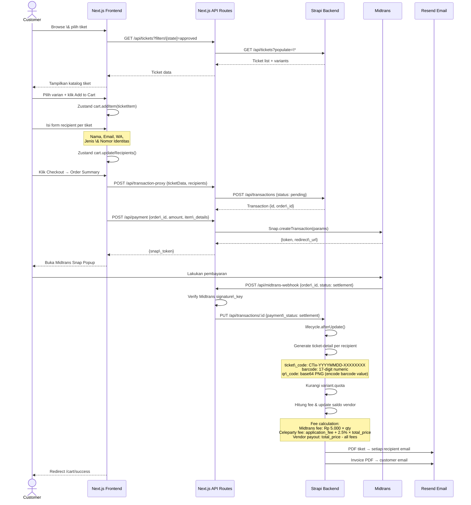
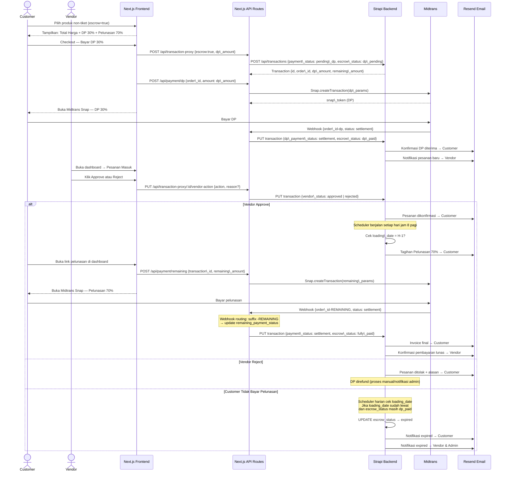
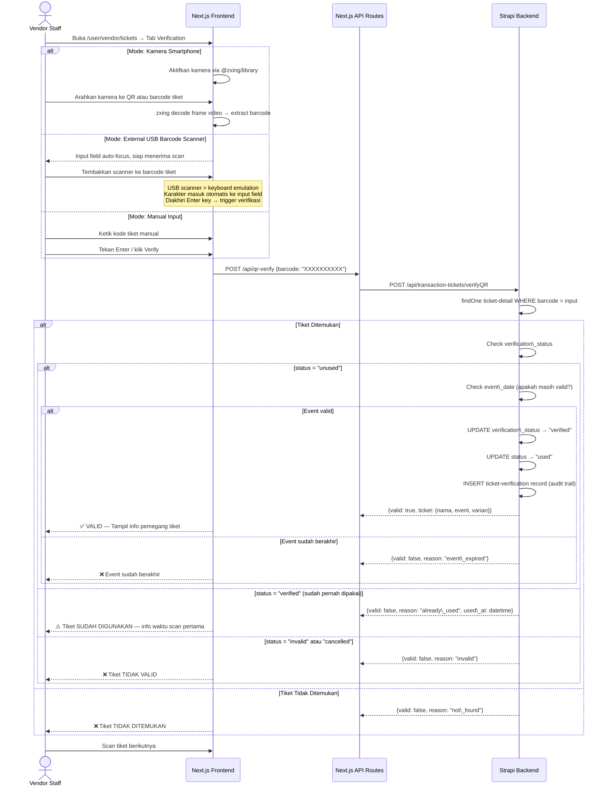
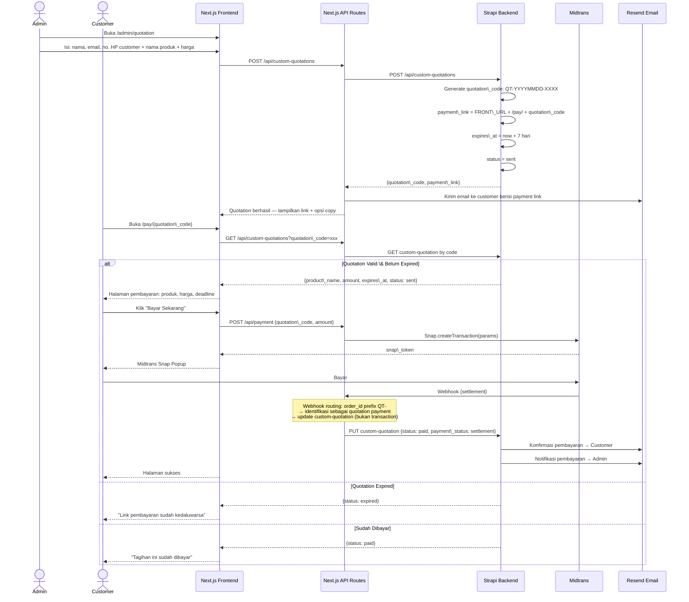
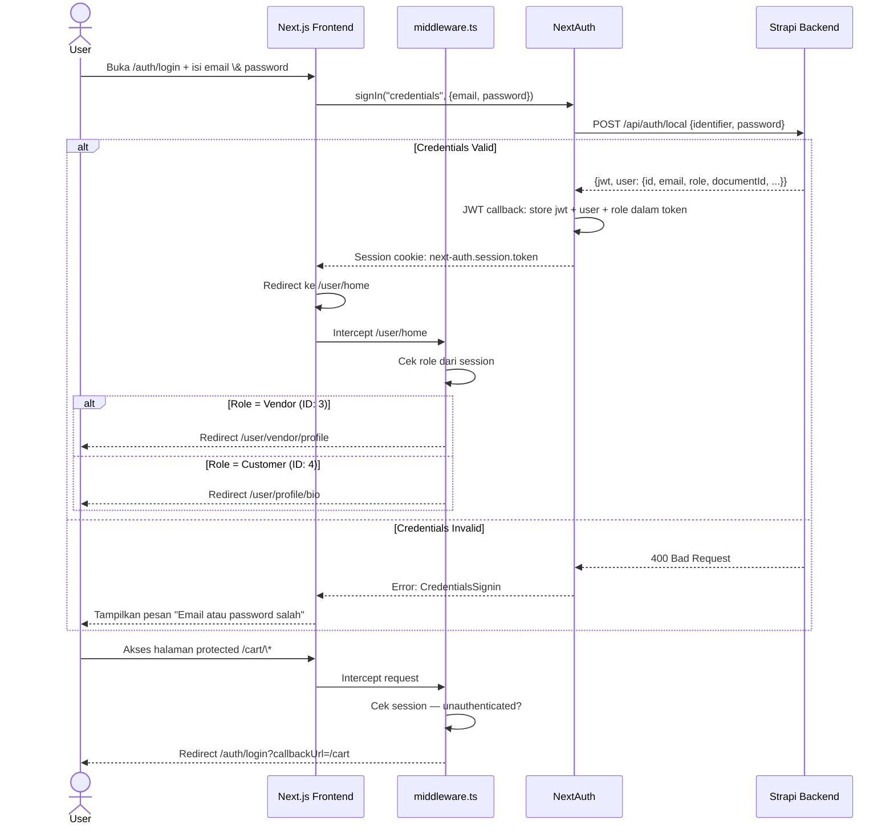
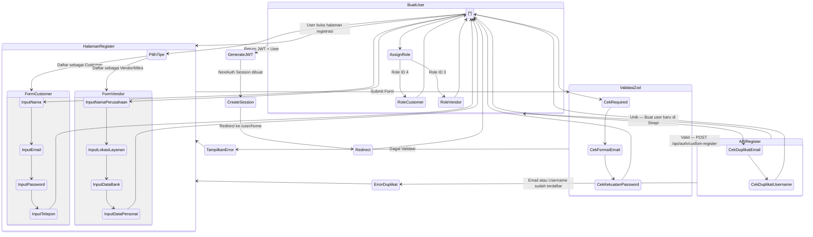
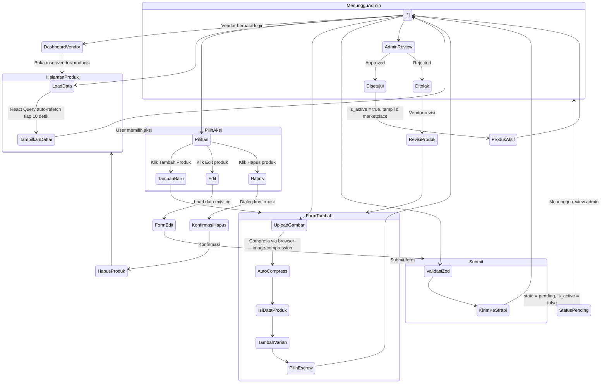
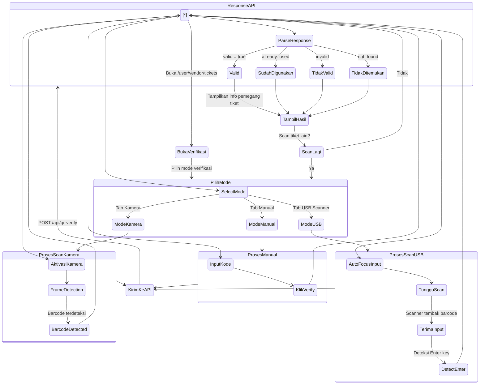

# CELEPARTY — Dokumentasi Pengembangan Teknis Komprehensif

> \*\*Versi Dokumen:\*\* 2.1  
> \*\*Tanggal Kontrak:\*\* 26 Juni 2026  
> \*\*Periode Pengerjaan:\*\* 1 Juli 2026 – 30 Oktober 2026  
> \*\*Nilai Kontrak:\*\* Rp X.000.000  
> \*\*Klien (Pihak Pertama):\*\* Rizky Fadillah Hermawan  
> \*\*Status:\*\* Fully Implemented & Hardened (Production Ready)  

\---

## DAFTAR ISI

1. [Ringkasan Proyek \& Kontrak](#1-ringkasan-proyek--kontrak)
2. [Analisis Ruang Lingkup Kontrak](#2-analisis-ruang-lingkup-kontrak)
3. [Arsitektur Sistem](#3-arsitektur-sistem)
4. [Entity Relationship Diagram (ERD)](#4-entity-relationship-diagram-erd)
5. [Sequence Diagrams](#5-sequence-diagrams)
6. [Flowcharts](#6-flowcharts)
7. [Activity Diagrams](#7-activity-diagrams)
8. [Pemetaan Pekerjaan: Backend vs Frontend](#8-pemetaan-pekerjaan-backend-vs-frontend)
9. [Rencana Kerja Detail — Dari Termudah ke Tersulit](#9-rencana-kerja-detail--dari-termudah-ke-tersulit)
10. [API Endpoint Reference](#10-api-endpoint-reference)
11. [Schema Database](#11-schema-database)
12. [Environment Variables](#12-environment-variables)
13. [Milestone \& Jadwal Pembayaran](#13-milestone--jadwal-pembayaran)
14. [Acceptance Criteria](#14-acceptance-criteria)

\---

## 1\. RINGKASAN PROYEK \& KONTRAK

### 1.1 Informasi Kontrak

|Atribut|Detail|
|-|-|
|**Proyek**|Website Celeparty — Marketplace Event Platform|
|**Klien (Pihak Pertama)**|Rizky Fadillah Hermawan|
|**Developer (Pihak Kedua)**|TBD|
|**Nilai Kontrak**|Rp X.000.000|
|**Periode**|1 Juli 2026 – 30 Oktober 2026 (4 bulan)|
|**Masa Garansi**|30 hari kalender setelah serah terima|
|**Poin Pekerjaan**|5 modul utama, 21 sub-item|

### 1.2 Skema Pembayaran

|Tahap|Jumlah|Trigger|
|-|-|-|
|**DP (Down Payment)**|Rp X.000.000|Awal pekerjaan (1 Juli 2026)|
|**Termin Kedua**|Rp X.000.000|Selesai Modul A (Perbaikan Struktur) + Modul B (Tiket)|
|**Pelunasan**|Rp X.000.000|Selesai 100% + serah terima|

### 1.3 Platform & Stack Teknologi
Dokumentasi ini mencakup transisi teknologi dari basis awal ke arsitektur modern kelas korporat (*corporate-grade*).

|Layer|Teknologi|Versi|Fungsi|Status / Keterangan|
|-|-|-|-|-|
|**Frontend**|Next.js (App Router)|14.2.23|*SSR*, *CSR*, *routing*|Didesain ulang secara menyeluruh (*comprehensive redesign*) untuk mencapai standar estetika *modern* & *corporate-grade*|
|**Bahasa FE**|TypeScript|5.3.3|*Type safety*|Aktif|
|**Styling**|Tailwind CSS|3.4.1|*Utility-first CSS*|Digunakan dengan optimasi struktur komponen desain modern|
|**Auth**|NextAuth.js|4.24.7|*JWT* + *Credentials*|Aktif|
|**State**|Zustand|4.5.2|*Cart*, *user*, *transaction store*|Aktif|
|**Data Fetching**|TanStack React Query|5.24.1|*Caching* & *auto-refetch*|Aktif|
|**Form**|React Hook Form + Zod|7.51.5 / 3.23.8|*Validasi form*|Aktif|
|**Payment**|Midtrans Snap|—|*Payment gateway*|Aktif|
|**Backend CMS**|Strapi|5.50.1|*Headless CMS*|Migrasi penuh ke *TypeScript*|
|**Bahasa BE**|TypeScript (Node.js ≥18)|—|*Server-side logic*|Migrasi 100% dari *JavaScript* (nol berkas `.js` sumber, tipe statis penuh)|
|**Database**|PostgreSQL|17+|*Production-grade database*|Migrasi penuh dari *SQLite* untuk stabilitas & performa tinggi|
|**Email**|Resend via Strapi plugin|—|*Transactional email*|Aktif|
|**PDF**|PDFKit (BE) + jsPDF (FE)|—|*E-ticket* & *invoice*|Aktif|
|**QR/Barcode**|zxing (FE) + qrcode (BE)|—|*Generate* & *scan*|Aktif|
|**UI Components**|Radix UI + shadcn/ui|—|Komponen aksesibel|Aktif|

---

## 2\. ANALISIS RUANG LINGKUP KONTRAK

### 2.1 Rangkuman Pekerjaan per Modul

|ID|Modul|Deskripsi Singkat|Layer|Status Existing|Prioritas|
|-|-|-|-|-|-|
|**A**|**Perbaikan Struktur Website**|||||
|A.a|Hapus kategori Event|Sisakan hanya Kategori Produk|Both|Existing|P1|
|A.b|Perapihan tampilan|Responsif \& konsisten|Frontend|Partial|P1|
|A.c|Filter by wilayah/lokasi vendor|Filter produk berdasarkan area layanan|Both|Partial|P1|
|**B**|**Modul Produk Tiket (Ticketing)**|||||
|B.a|Tampilkan daftar produk tiket|Listing + detail tiket|Frontend|Partial|P1|
|B.b|Alur pembelian tiket|Browse → Cart → Checkout → Payment|Both|Existing|P1|
|B.c|Form data pelanggan|Customer information per recipient|Frontend|Existing|P1|
|B.d|Sistem barcode unik|1 tiket = 1 barcode unik|Both|Existing|P1|
|B.e|Manajemen pesanan tiket + export CSV|Tabel pesanan + download CSV|Both|Partial|P1|
|B.f|Validasi tiket barcode scanner|Kamera smartphone + USB external|Frontend|Partial|P1|
|B.g|Kirim e-ticket via email|PDF attachment per recipient|Backend|Existing|P1|
|**C**|**Modul Produk Non-Tiket**|||||
|C.a|Tampilkan daftar produk/jasa + detail|Listing \& detail non-tiket|Frontend|Existing|P2|
|C.b|Alur pembelian produk/jasa|Purchase flow non-tiket|Both|Existing|P2|
|C.c|Approve/Reject pesanan oleh Vendor|Vendor action pada pesanan masuk|Both|**New**|P2|
|C.d|Mekanisme Escrow DP 30% + Pelunasan 70%|2-phase payment system|Both|**New**|P2|
|C.e|Manajemen pesanan + riwayat transaksi|Dashboard pesanan lengkap|Frontend|Partial|P2|
|C.f|Export data pesanan ke .xlsx|Download Excel pesanan|Both|Partial|P2|
|C.g|Notifikasi email per perubahan status|Email otomatis customer \& vendor|Backend|Partial|P2|
|**D**|**Custom Quotation**|||||
|D.a|Admin generate custom quotation|Form quotation di admin panel|Both|**New**|P3|
|D.b|Payment link custom quotation|Link bayar untuk customer|Both|**New**|P3|
|**E**|**Penyederhanaan Sistem**|||||
|E.a|Hapus fitur Rating \& Review|Sembunyikan dari UI|Both|Existing (remove)|P1|
|E.b|Auto compress foto produk|Browser-side compression saat upload|Frontend|**New**|P2|
|**F**|**Bonus Service (Layanan Tambahan)**|||||
|F.a|Guest checkout untuk tiket|Pembelian tiket tanpa registrasi akun|Both|**New**|P3 (Bonus)|
|F.b|SEO & Slug friendly URLs|Struktur URL & dynamic meta tags untuk SEO|Frontend|**New**|P3 (Bonus)|
|F.c|Optimisasi Performa Sistem|React Query staleTime, image lazy load, dynamic imports|Both|**New**|P3 (Bonus)|

### 2.2 Legenda Status

|Status|Keterangan|
|-|-|
|**Existing**|Sudah ada dan berjalan, mungkin perlu penyesuaian minor|
|**Partial**|Sebagian sudah ada, perlu penyelesaian atau perbaikan|
|**New**|Belum ada, harus dibangun dari awal|
|**Existing (remove)**|Ada tapi perlu dihapus/disembunyikan|

\---

## 3\. ARSITEKTUR SISTEM

### 3.1 Diagram Arsitektur Keseluruhan (v2.0)

```
┌──────────────────────────────────────────────────────────────────────┐
│                       CELEPARTY SYSTEM v2.0                          │
│                                                                      │
│  ┌────────────────────────────────────────────────────────────────┐  │
│  │                FRONTEND — celeparty-fe (Next.js 14)            │  │
│  │                                                                │  │
│  │  PUBLIC ROUTES          CUSTOMER (Auth)      VENDOR (Auth)     │  │
│  │  ├─ /                   ├─ /cart             ├─ /vendor/       │  │
│  │  ├─ /products           ├─ /cart/order-      │  profile        │  │
│  │  ├─ /products/\[slug]    │  summary           ├─ /vendor/       │  │
│  │  ├─ /blog               ├─ /user/profile/    │  products       │  │
│  │  ├─ /auth/\*             │  bio               ├─ /vendor/       │  │
│  │  └─ /pay/\[code] ★NEW   └─ /user/profile/    │  orders         │  │
│  │                             orders           ├─ /vendor/       │  │
│  │  ADMIN ROUTES ★NEW                           │  tickets        │  │
│  │  └─ /admin/quotation                         └─ /vendor/       │  │
│  │                                                 wallet         │  │
│  └──────────────────────────────┬─────────────────────────────────┘  │
│                                 │ Next.js API Routes (Proxy Layer)   │
│                                 ▼                                    │
│  ┌────────────────────────────────────────────────────────────────┐  │
│  │               STRAPI BACKEND v5 — celeparty-strapi             │  │
│  │                                                                │  │
│  │  Content Types (13 existing + 1 NEW):                         │  │
│  │  ✓ User (extended +18 fields)   ✓ Product     ✓ Ticket        │  │
│  │  ✓ Equipment                    ✓ Transaction ✓ Txn-Ticket    │  │
│  │  ✓ Ticket-Detail                ✓ Ticket-Verif ✓ Send-History │  │
│  │  ✓ Category   ✓ Blog  ✓ Banner  ✓ User-Event-Type             │  │
│  │  ★ Custom-Quotation (NEW)                                      │  │
│  │                                                                │  │
│  │  Business Logic:                                              │  │
│  │  ✓ Cron Job (60s) — expire variants \& products               │  │
│  │  ✓ Lifecycles — email, PDF, QR, barcode generation           │  │
│  │  ★ Escrow Logic — 2-phase payment (NEW)                       │  │
│  │  ★ Vendor Approve/Reject (NEW)                                │  │
│  │  ★ Scheduler — reminder pelunasan H-1 (NEW)                   │  │
│  │                                                                │  │
│  │  DB: PostgreSQL 17+ (Dev & Prod)                              │  │
│  └────────────────────────────────────────────────────────────────┘  │
│                                                                      │
│  EXTERNAL SERVICES                                                   │
│  ┌──────────────┐  ┌──────────────┐  ┌───────────────────────────┐  │
│  │   Midtrans   │  │    Resend    │  │  browser-image-compression │  │
│  │  Snap API    │  │  Email API   │  │  (FE, client-side) ★NEW   │  │
│  └──────────────┘  └──────────────┘  └───────────────────────────┘  │
└──────────────────────────────────────────────────────────────────────┘

★ = Komponen baru yang perlu dibangun
```

### 3.2 File Struktur yang Akan Dimodifikasi

#### Backend (celeparty-strapi)

```
src/
├── api/
│   ├── transaction/
│   │   ├── content-types/transaction/schema.json   ★ Tambah: vendor\_status, escrow fields
│   │   └── lifecycles.js                           ★ Tambah: escrow logic, vendor email
│   ├── transaction-ticket/
│   │   ├── controllers/transaction-ticket.js       ✎ Update: verifyQR improvement
│   │   └── lifecycles.js                           ✎ Update: email trigger, barcode display
│   ├── product/
│   │   └── lifecycles.js                           ✎ Update: status change email notif
│   └── custom-quotation/ (★ BARU)
│       ├── content-types/custom-quotation/schema.json
│       ├── controllers/custom-quotation.js
│       └── routes/custom.js
└── index.js                                        ★ Tambah: scheduler pelunasan H-1
```

#### Frontend (celeparty-fe)

```
app/
├── products/
│   └── ProductContent.tsx                          ✎ Update: filter wilayah/lokasi
├── user/vendor/
│   ├── orders/page.tsx                             ✎ Update: approve/reject + escrow UI
│   ├── tickets/page.tsx                            ✎ Update: USB scanner mode
│   └── add-product/page.tsx                        ✎ Update: toggle escrow
├── admin/
│   └── quotation/page.tsx                          ★ BARU: admin custom quotation form
└── pay/
    └── \[code]/page.tsx                             ★ BARU: payment page custom quotation

components/
├── product/
│   ├── ProductFilters.tsx                          ✎ Update: filter lokasi
│   ├── ProductForm.tsx                             ✎ Update: escrow toggle
│   └── FileUploader.tsx                            ★ Update: auto-compress integration
└── profile/vendor/
    ├── equipment-management/                       ✎ Update: approve/reject actions
    └── ticket-management/TicketScan.tsx            ✎ Update: USB scanner mode

lib/
├── utils/exportUtils.ts                            ✎ Update: tambah xlsx export
└── store/cart.ts                                   ✎ Update: escrow flag
```

\---

## 4\. ENTITY RELATIONSHIP DIAGRAM (ERD)

> **Catatan Arsitektural:**
> - `VARIANT_PRODUCT` adalah **Strapi repeatable component**, bukan content type mandiri. Di database Strapi 5, data component disimpan di tabel terpisah (`components_variant_products`), namun secara konseptual ini bukan entity independen — ia selalu terikat ke parent (Product, Ticket, atau Equipment).
> - Sistem saat ini menggunakan **dual transaction model** (`transaction` untuk equipment dan `transaction-ticket` untuk tiket). Migrasi ke unified transaction system **BUKAN** termasuk dalam scope kontrak ini. Kedua content type tetap dipertahankan dan digunakan secara paralel.
> - `User` memiliki **dua relasi** ke `Transaction`: sebagai **customer** (yang melakukan order) dan sebagai **vendor** (pemilik produk yang dipesan, diidentifikasi via `vendor_doc_id` — bukan FK langsung).

```mermaid
erDiagram
    USER {
        string id PK
        string documentId
        string username
        string email
        string phone
        string name
        string birthplace
        date birthdate
        string nik
        string companyName
        string bankName
        string accountNumber
        string accountName
        json serviceLocation
        string saldo\_active
        string saldo\_refund
        int role\_id FK
    }

    ROLE {
        int id PK
        string name
        string type
    }

    CATEGORY {
        string id PK
        string title
        media image
    }

    USER\_EVENT\_TYPE {
        string id PK
        string name
        int application\_fee
        boolean is\_ticket
    }

    PRODUCT {
        string id PK
        string title
        text description
        text terms\_conditions
        string state
        boolean is\_active
        boolean escrow
        string kabupaten
        string region
        string lokasi\_event
        string kota\_event
        string event\_date
        string end\_date
        string end\_time
        int sold\_count
        int user\_id FK
        int category\_id FK
        int user\_event\_type\_id FK
    }

    TICKET {
        string id PK
        string title
        text description
        text terms\_conditions
        string state
        boolean is\_active
        boolean escrow
        string event\_date
        string end\_date
        string lokasi\_event
        string kota\_event
        int sold\_count
        int user\_id FK
        int user\_event\_type\_id FK
    }

    EQUIPMENT {
        string id PK
        string title
        text description
        text terms\_conditions
        int minimal\_order
        string minimal\_order\_date
        int main\_price
        int price\_min
        int price\_max
        string maximal\_order\_date
        string kabupaten
        string region
        string lokasi\_event
        string kota\_event
        boolean is\_active
        string state
        int user\_id FK
    }

    VARIANT\_PRODUCT {
        string id PK "Strapi Component"
        string name
        media image
        int price
        string quota
        string purchase\_deadline
        boolean active
        string parent\_type "internal"
        string parent\_id FK "internal"
    }

    TRANSACTION {
        string id PK
        string order\_id
        string payment\_status
        string vendor\_status
        string vendor\_rejection\_reason
        datetime vendor\_approved\_at
        boolean escrow
        string escrow\_status
        string dp\_amount
        string dp\_order\_id
        string dp\_payment\_status
        datetime dp\_paid\_at
        string remaining\_amount
        string remaining\_order\_id
        string remaining\_payment\_status
        datetime remaining\_paid\_at
        boolean reminder\_sent
        string product\_id
        string variant\_id
        string variant
        int quantity
        string shipping\_location
        string event\_date
        string loading\_date
        string customer\_name
        string telp
        string email
        text note
        json products
        string event\_type
        boolean verification
        string vendor\_doc\_id
        json ticket\_recipients
        int total\_quantity
        string total\_price
        int product\_rel\_id FK
    }

    TRANSACTION\_TICKET {
        string id PK
        string order\_id
        string product\_id
        string product\_name
        string variant\_id
        string variant
        string price
        string quantity
        string customer\_name
        string telp
        string total\_price
        string payment\_status
        string event\_date
        string event\_type
        text note
        string customer\_mail
        boolean verification
        string vendor\_doc\_id
        json recipients
        json products
    }

    TICKET\_DETAIL {
        string id PK
        string ticket\_code
        string unique\_token
        text qr\_code
        text qr\_code\_encrypted
        string verification\_status
        string payment\_status
        string buyer\_email
        string buyer\_phone
        string buyer\_name
        datetime verified\_at
        boolean is\_bypass
        string recipient\_name
        string identity\_type
        string identity\_number
        string whatsapp\_number
        string recipient\_email
        string barcode
        string status
        int transaction\_ticket\_id FK
        int ticket\_id FK
        int product\_id FK
        int verified\_by FK
        int user\_id FK
    }

    TICKET\_VERIFICATION {
        string id PK
        string ticket\_code
        string verification\_type
        datetime verified\_at
        string result
        string failure\_reason
        string ip\_address
        string device\_info
        text notes
        int ticket\_detail\_id FK
        int verified\_by FK
    }

    TICKET\_SEND\_HISTORY {
        string id PK
        string variant
        int recipient\_count
        int successful\_count
        int failed\_count
        json recipients
        text message
        datetime sent\_at
        string status
        text error\_log
        int ticket\_id FK
        int product\_id FK
        int sent\_by FK
    }

    BLOG {
        string id PK
        string title
        text content
        int category\_id FK
    }

    BANNER {
        string id PK
        string title
        string url
        int order
    }

    CUSTOM\_QUOTATION {
        string id PK
        string quotation\_code
        string customer\_name
        string customer\_email
        string customer\_phone
        string product\_name
        text description
        int amount
        string payment\_link
        string status
        string payment\_status
        string order\_id
        datetime expires\_at
        boolean reminder\_sent
        int created\_by\_user FK
    }

    USER ||--|| ROLE : "has"
    USER ||--o{ PRODUCT : "owns"
    USER ||--o{ TICKET : "owns"
    USER ||--o{ EQUIPMENT : "owns"
    USER ||--o{ TRANSACTION : "places as customer"
    USER ||--o{ TRANSACTION : "receives order as vendor via vendor_doc_id"
    USER ||--o{ TRANSACTION\_TICKET : "places as customer"
    USER ||--o{ CUSTOM\_QUOTATION : "creates"

    PRODUCT ||--o{ VARIANT\_PRODUCT : "has variants"
    TICKET ||--o{ VARIANT\_PRODUCT : "has variants"
    EQUIPMENT ||--o{ VARIANT\_PRODUCT : "has variants"

    PRODUCT }o--|| CATEGORY : "belongs to"
    PRODUCT }o--|| USER\_EVENT\_TYPE : "typed as"
    TICKET }o--|| USER\_EVENT\_TYPE : "typed as"

    PRODUCT ||--o{ TRANSACTION : "ordered in"
    TICKET ||--o{ TRANSACTION\_TICKET : "ordered in"

    TRANSACTION\_TICKET ||--o{ TICKET\_DETAIL : "generates"
    TICKET\_DETAIL ||--o{ TICKET\_VERIFICATION : "verified in"
    TICKET ||--o{ TICKET\_SEND\_HISTORY : "tracked in"

    BLOG }o--|| CATEGORY : "categorized in"
    BLOG }o--o{ PRODUCT : "features"
    BLOG }o--o{ TICKET : "features"
    CATEGORY }o--o{ USER\_EVENT\_TYPE : "related to"
```

\---

## 5\. SEQUENCE DIAGRAMS

### 5.1 Alur Pembelian Tiket (End-to-End)



### 5.2 Alur Pembelian Non-Tiket dengan Escrow (NEW)



### 5.3 Alur Verifikasi Tiket via Barcode Scanner



### 5.4 Alur Custom Quotation (NEW)



### 5.5 Alur Autentikasi \& Role-Based Redirect



\---

## 6\. FLOWCHARTS

### 6.1 Approval Workflow Produk \& Tiket

```mermaid
flowchart TD
    A(\[Vendor Submit Produk atau Tiket]) --> B{Validasi Form\\nZod Schema — FE}
    B -->|Gagal| C\[Tampilkan Error per Field]
    C --> A
    B -->|Valid| D\[Auto-compress Gambar\\nbrowser-image-compression]
    D --> E\[Upload ke Strapi Media]
    E --> F\[POST ke Strapi\\nstate: pending, is\_active: false]
    F --> G\[(DB: state = pending)]
    G --> H\[Admin melihat item baru\\ndi Strapi CMS Panel]
    H --> I{Admin Review}

    I -->|Approve| J\[UPDATE state = approved\\nis\_active = true]
    I -->|Reject| K\[UPDATE state = rejected\\nis\_active = false]

    J --> L\[Lifecycle: afterUpdate]
    L --> M\[Kirim Email ke Vendor:\\nProduk/Tiket Disetujui ✅]
    M --> N\[Produk/Tiket tampil\\ndi Marketplace publik]

    K --> O\[Lifecycle: afterUpdate]
    O --> P\[Kirim Email ke Vendor:\\nDitolak ❌ beserta alasan]
    P --> Q\[Vendor revisi \& submit ulang]
    Q --> A
```

### 6.2 Alur Pembayaran Escrow (2-Phase)

```mermaid
flowchart TD
    A(\[Customer Pilih Produk Escrow]) --> B\[FE Tampilkan Rincian:\\nTotal, DP 30%, Pelunasan 70%]
    B --> C{Customer Setuju?}
    C -->|Tidak| D(\[Kembali ke Halaman Produk])
    C -->|Ya| E\[Checkout → Buat Transaksi\\npayment\_status: pending\_dp\\nescrow\_status: dp\_pending]
    E --> F\[Init Midtrans Snap\\nAmount = total\_price × 30%]
    F --> G{Pembayaran DP}
    G -->|Gagal / Expired| H\[Update: payment\_status = failed\\nNotifikasi ke Customer]
    G -->|Settlement| I\[Update: dp\_payment\_status = settlement\\nescrow\_status = dp\_paid\\ndp\_paid\_at = now]
    I --> J\[Email: Konfirmasi DP → Customer]
    I --> K\[Email: Pesanan Baru → Vendor]
    K --> L{Vendor Review Pesanan}

    L -->|Reject| M\[vendor\_status = rejected\\nEmail alasan → Customer]
    M --> N\[Proses refund DP via admin]

    L -->|Approve| O\[vendor\_status = approved\\nEmail konfirmasi → Customer]
    O --> P{Scheduler Harian\\nH-1 Sebelum Loading Date}
    P --> Q\[Email Tagihan Pelunasan 70% → Customer\\nDengan link bayar]
    Q --> R{Customer Bayar Pelunasan}
    R -->|Tidak Bayar → Deadline| S\[status = expired\\nNotifikasi \& tindak lanjut]
    R -->|Settlement| T\[UPDATE:\\nremaining\_payment\_status = settlement\\nescrow\_status = fully\_paid\\npayment\_status = settlement]
    T --> U\[Generate Invoice PDF]
    U --> V\[Email Invoice Final → Customer]
    V --> W\[Email Konfirmasi Settlement → Vendor]
    W --> X(\[Transaksi Selesai ✅])
```

### 6.3 Alur Custom Quotation

```mermaid
flowchart TD
    A(\[Admin Buka Halaman Custom Quotation]) --> B\[Isi Form:\\nNama, Email, No HP Customer\\nNama Produk, Deskripsi, Harga]
    B --> C{Validasi Input}
    C -->|Invalid| D\[Error: Field Wajib]
    D --> B
    C -->|Valid| E\[Generate Kode Unik:\\nQT-YYYYMMDD-XXXX]
    E --> F\[Generate Payment Link:\\nceleparty.com/pay/QT-XXXXXX]
    F --> G\[Set expires\_at = +7 Hari\\nstatus = sent]
    G --> H\[(Simpan ke DB)]
    H --> I\[Kirim Email ke Customer\\nberisi payment link dan detail]

    I --> J{Customer Buka Link}
    J -->|Link Expired| K\[Tampilkan: Link Kedaluwarsa]
    K --> L(\[Admin Buat Quotation Baru])
    J -->|Sudah Dibayar| M\[Tampilkan: Sudah Dibayar]
    J -->|Link Valid| N\[Tampilkan Halaman Pembayaran:\\nNama Produk, Harga, Deadline]

    N --> O{Customer Bayar?}
    O -->|Tidak| P(\[Quotation Expired otomatis])
    O -->|Ya| Q\[Buka Midtrans Snap Popup]
    Q --> R{Status Pembayaran Midtrans}
    R -->|Gagal| S\[Tampilkan Error — Coba Lagi]
    S --> N
    R -->|Settlement| T\[UPDATE: status = paid]
    T --> U\[Email Konfirmasi → Customer]
    T --> V\[Email Notifikasi → Admin]
    U --> W(\[Quotation Selesai ✅])
    V --> W
```

### 6.4 Alur Validasi Tiket via Scanner

```mermaid
flowchart TD
    A(\[Buka Halaman Verification\\n/user/vendor/tickets]) --> B{Pilih Mode Scanner}

    B -->|Kamera| C\[Aktifkan Camera API\\n@zxing/library stream]
    B -->|USB External Scanner| D\[Tampilkan Input Field\\nAuto-focus untuk terima input]
    B -->|Manual Input| E\[Tampilkan Text Input + Tombol Verify]

    C --> F\[Kamera Aktif — Frame-by-Frame Scan]
    F --> G{zxing detect barcode?}
    G -->|Belum| F
    G -->|Terdeteksi| H\[Extract barcode value]

    D --> I{Tunggu Input dari USB Scanner}
    I -->|Scanner tembak barcode| J\[Karakter masuk ke input field]
    J --> K{Detect Enter key?}
    K -->|Ya| H

    E --> L\[User ketik kode manual]
    L --> M\[Klik Verify atau tekan Enter]
    M --> H

    H --> N\[POST /api/qr-verify dengan barcode]
    N --> O{Response dari Backend}

    O -->|valid = true| P\[✅ VALID\\nTampilkan: Nama, Event, Varian\\nAudio beep sukses]
    O -->|already\_used| Q\[⚠️ SUDAH DIPAKAI\\nInfo waktu scan pertama]
    O -->|invalid| R\[❌ TIDAK VALID]
    O -->|not\_found| S\[❌ TIDAK DITEMUKAN]

    P --> T{Scan Berikutnya?}
    Q --> T
    R --> T
    S --> T
    T -->|Ya| B
    T -->|Tidak| U(\[Selesai])
```

\---

## 7\. ACTIVITY DIAGRAMS

### 7.1 Aktivitas Registrasi Customer \& Vendor



### 7.2 Aktivitas Manajemen Produk oleh Vendor



### 7.3 Aktivitas Verifikasi Tiket oleh Vendor Staff



\---

## 8\. PEMETAAN PEKERJAAN: BACKEND vs FRONTEND

### 8.1 Tabel Pemetaan Lengkap

|ID|Pekerjaan|Backend|Frontend|Layer Utama|
|-|-|:-:|:-:|-|
|**A. Perbaikan Struktur**|||||
|A.a|Hapus kategori Event|✅ Data cleanup|✅ Remove dari UI|Both|
|A.b|Perapihan tampilan responsif|❌|✅ CSS/Tailwind|FE Only|
|A.c|Filter by wilayah/lokasi vendor|✅ Query params|✅ Filter UI|Both|
|**B. Modul Tiket**|||||
|B.a|Listing produk tiket|✅ GET /api/tickets|✅ Halaman listing|Both|
|B.b|Alur pembelian tiket|✅ Transaction lifecycle|✅ Cart → Checkout|Both|
|B.c|Form data pelanggan per recipient|❌|✅ Form component|FE Only|
|B.d|Barcode unik (1 tiket = 1 barcode)|✅ Generation + storage|✅ Display barcode|BE Utama|
|B.e|Manajemen pesanan tiket + export CSV|✅ Query endpoint|✅ Table + CSV export|Both|
|B.f|Validasi via scanner (kamera + USB)|✅ verifyQR endpoint|✅ Scanner UI dual-mode|Both|
|B.g|Kirim e-ticket via email|✅ PDF gen + Resend|❌|BE Only|
|**C. Modul Non-Tiket**|||||
|C.a|Listing produk/jasa + detail|✅ GET /api/products|✅ Halaman listing|Both|
|C.b|Alur pembelian produk/jasa|✅ Transaction + validation|✅ Cart → Checkout|Both|
|C.c|Approve/Reject pesanan oleh Vendor|✅ vendor\_status field + endpoint|✅ Action buttons di dashboard|Both|
|C.d|Escrow DP 30% + Pelunasan 70%|✅ 2-phase payment logic, scheduler|✅ Escrow UI, tagihan pelunasan|Both|
|C.e|Manajemen pesanan + riwayat|✅ Filtered query|✅ Tabel + tabs|Both|
|C.f|Export pesanan ke .xlsx|❌|✅ SheetJS client-side|FE Only|
|C.g|Notifikasi email per status change|✅ Lifecycle triggers|❌|BE Only|
|**D. Custom Quotation**|||||
|D.a|Admin generate quotation|✅ Content type baru + controller|✅ Admin panel form|Both|
|D.b|Payment link custom quotation|✅ Unique code + payment hook|✅ Halaman /pay/\[code]|Both|
|**E. Penyederhanaan**|||||
|E.a|Hapus Rating \& Review|✅ Optional: disable field|✅ Remove semua komponen|FE Utama|
|E.b|Auto compress foto produk|❌|✅ browser-image-compression|FE Only|

### 8.2 Ringkasan Volume per Layer

|Layer|Jumlah Task|Persentase|
|-|-|-|
|Backend Only|3 (B.g, C.g, dan sebagian kecil lainnya)|\~14%|
|Frontend Only|4 (A.b, B.c, C.f, E.b)|\~19%|
|Full Stack (Keduanya)|14 task|\~67%|

### 8.3 File-File Kunci yang Dimodifikasi

**Backend (celeparty-strapi):**

|File|Jenis|Task Terkait|
|-|-|-|
|`src/api/transaction/content-types/transaction/schema.json`|Modifikasi|C.c, C.d|
|`src/api/transaction/lifecycles.js`|Modifikasi|C.c, C.d, C.g|
|`src/api/transaction-ticket/controllers/transaction-ticket.js`|Modifikasi|B.d, B.f|
|`src/api/product/lifecycles.js`|Modifikasi|C.g|
|`src/api/custom-quotation/`|**Baru**|D.a, D.b|
|`src/index.js`|Modifikasi|C.d (scheduler)|

**Frontend (celeparty-fe):**

|File|Jenis|Task Terkait|
|-|-|-|
|`app/products/ProductContent.tsx`|Modifikasi|A.c|
|`app/user/vendor/orders/page.tsx`|Modifikasi|C.c, C.d|
|`app/user/vendor/tickets/page.tsx`|Modifikasi|B.f|
|`app/admin/quotation/page.tsx`|**Baru**|D.a|
|`app/pay/\[code]/page.tsx`|**Baru**|D.b|
|`components/product/ProductFilters.tsx`|Modifikasi|A.c|
|`components/product/ProductForm.tsx`|Modifikasi|C.d, E.b|
|`components/product/FileUploader.tsx`|Modifikasi|E.b|
|`components/profile/vendor/ticket-management/TicketScan.tsx`|Modifikasi|B.f|
|`lib/utils/exportUtils.ts`|Modifikasi|B.e, C.f|
|`lib/store/cart.ts`|Modifikasi|C.d|

\---

## 9\. RENCANA KERJA DETAIL — DARI TERMUDAH KE TERSULIT

> Urutan disusun berdasarkan estimasi kompleksitas implementasi, bukan prioritas bisnis. Dalam praktik pengerjaan, prioritas bisnis (P1 → P2 → P3) tetap menjadi panduan urutan delivery.

\---

### 🟢 LEVEL 1 — SANGAT MUDAH (< 2 Jam per Task)

\---

#### \[E.a] Hapus Fitur Rating \& Review

**Deskripsi:** Menyembunyikan semua elemen rating dan review dari UI karena belum menjadi bagian implementasi fase ini.

**Layer:** Frontend (utama), Backend (minor opsional)

**Estimasi:** 1–2 jam

**Langkah Frontend:**

1. Cari semua file yang mengandung komponen rating:

```bash
   grep -r "rate\\|rating\\|review\\|Review\\|Rating\\|StarRating" app/ components/ --include="\*.tsx" -l
   ```

2. Hapus atau comment komponen rating dari:

   * Halaman detail produk (`/products/\[slug]/page.tsx`) — hapus blok rating stars
   * Card produk (`components/product/ItemProduct.tsx`) — hapus rating display
   * Form tambah/edit produk (`components/product/ProductForm.tsx`) — hapus field `rate`
   * Dashboard vendor — hapus kolom/field rate di tabel produk
3. Update interface TypeScript di `lib/interfaces/iProduct.ts`:

```typescript
   // Ubah menjadi optional agar tidak ada TypeScript error
   rate?: number;
   ```

**Langkah Backend (Opsional):**

* Field `rate` di schema boleh dibiarkan di database untuk backward compatibility
* Cukup tidak sertakan `rate` di populate query dan tidak tampilkan di FE

**Acceptance Criteria:**

* \[ ] Tidak ada bintang rating / angka rating terlihat di halaman mana pun
* \[ ] Tidak ada error TypeScript setelah perubahan
* \[ ] Form tambah produk tidak memiliki input untuk rating

\---

#### \[A.a] Hapus Kategori "Event" dari Sistem

**Deskripsi:** Menghapus kategori "Event" dan menyisakan hanya Kategori Produk.

**Layer:** Frontend + Backend (data cleanup)

**Estimasi:** 1–2 jam

**Langkah Backend:**

1. Login ke Strapi Admin Panel → Content Manager → Category
2. Hapus entry kategori "Event"
3. Pastikan produk/tiket yang sebelumnya berelasi dengan kategori ini tidak terputus (reassign ke kategori yang sesuai)

**Langkah Frontend:**

1. Cari referensi hardcoded kategori "Event" di seluruh codebase:

```bash
   grep -r "Event\\|event" lib/static/categories.tsx app/
   ```

2. Hapus opsi "Event" dari `lib/static/categories.tsx`
3. Update filter kategori di halaman `/products`
4. Update komponen `EventList.tsx` jika masih merender opsi "Event"

**Acceptance Criteria:**

* \[ ] Kategori "Event" tidak muncul di dropdown form produk vendor
* \[ ] Kategori "Event" tidak muncul di filter halaman /products
* \[ ] Tidak ada error relasi yang rusak setelah penghapusan data

\---

### 🟡 LEVEL 2 — MUDAH (2–4 Jam per Task)

\---

#### \[E.b] Auto Compress Foto Produk saat Upload

**Deskripsi:** Mengompresi gambar secara otomatis di sisi client (browser) sebelum diunggah ke server, untuk menghemat bandwidth dan storage Strapi.

**Layer:** Frontend only

**Estimasi:** 2–3 jam

**Instalasi Dependency:**

```bash
npm install browser-image-compression
```

**Langkah Implementasi di `components/product/FileUploader.tsx`:**

```typescript
import imageCompression from 'browser-image-compression';

const compressionOptions = {
  maxSizeMB: 1,              // Maksimal 1MB hasil kompresi
  maxWidthOrHeight: 1920,    // Maksimal dimensi
  useWebWorker: true,        // Non-blocking di main thread
  onProgress: (progress: number) => setCompressionProgress(progress),
};

const handleFileChange = async (event: React.ChangeEvent<HTMLInputElement>) => {
  const files = Array.from(event.target.files || \[]);
  setIsCompressing(true);

  const compressedFiles = await Promise.all(
    files.map(async (file) => {
      if (file.size > 500 \* 1024) { // Hanya compress jika > 500KB
        return await imageCompression(file, compressionOptions);
      }
      return file;
    })
  );

  setIsCompressing(false);
  // Lanjutkan dengan compressedFiles ke proses upload
  onFilesReady(compressedFiles);
};
```

**UI Enhancement:**

* Tambahkan loading indicator `"Mengompresi gambar..."` saat proses berlangsung
* Tampilkan ukuran sebelum/sesudah: `"12.3 MB → 0.8 MB"`
* Terapkan ke semua titik upload: `ProductForm.tsx`, form edit produk, form profil

**Acceptance Criteria:**

* \[ ] File gambar > 1MB dikompresi otomatis sebelum dikirim ke server
* \[ ] Kualitas gambar masih acceptable setelah kompresi
* \[ ] Progress/loading indicator tampil saat kompresi berlangsung
* \[ ] Flow upload tidak berubah dari sisi user experience

\---

#### \[A.b] Perapihan Tampilan Frontend (Responsif \& Konsisten)

**Deskripsi:** Memperbaiki ketidakkonsistenan tampilan dan memastikan semua halaman responsif di mobile, tablet, dan desktop.

**Layer:** Frontend only

**Estimasi:** 3–4 jam

**Checklist Breakpoint Testing:**

|Breakpoint|Width|Perangkat Target|
|-|-|-|
|Mobile S|375px|iPhone SE, Android small|
|Mobile L|414px|iPhone Plus, Android large|
|Tablet|768px|iPad, tablet|
|Desktop|1280px|Laptop|
|Wide|1440px|Desktop monitor|

**Area Prioritas untuk Diperbaiki:**

1. **Header navigasi** — hamburger menu di mobile, semua link terbaca
2. **Halaman listing produk** — grid yang responsif (1 kolom mobile, 2 tablet, 3-4 desktop)
3. **Halaman detail produk** — layout dua kolom yang collapse ke satu kolom di mobile
4. **Halaman cart \& checkout** — form yang nyaman diisi di mobile
5. **Dashboard vendor** — tabel yang scrollable horizontal di mobile
6. **Halaman registrasi** — form yang tidak overflow di layar kecil

**Brand Design System (wajib konsisten):**

```css
/\* Design Tokens yang harus digunakan \*/
--c-blue: #3E2882;    /\* Primary — ungu \*/
--c-green: #CBD002;   /\* Accent — kuning-hijau \*/
--c-orange: #DA7E01;  /\* Secondary accent \*/
--c-red: #d41f31;     /\* Danger \*/
```

**Acceptance Criteria:**

* \[ ] Tidak ada horizontal scroll yang tidak disengaja di halaman mana pun
* \[ ] Semua teks terbaca jelas (body min. 14px, input min. 16px)
* \[ ] Touch target tombol minimal 44×44px di mobile
* \[ ] Konsistensi warna brand di seluruh aplikasi

\---

### 🟠 LEVEL 3 — SEDANG (4–8 Jam per Task)

\---

#### \[B.a + C.a] Listing Produk Tiket \& Non-Tiket

**Deskripsi:** Memastikan halaman listing menampilkan tiket dan produk non-tiket dengan informasi lengkap, termasuk handling edge case quota habis dan expired.

**Layer:** Both

**Estimasi:** 4–6 jam

**Backend — Pastikan API Permissions:**

* `GET /api/tickets` — akses Public di Strapi permissions
* `GET /api/products` — akses Public di Strapi permissions
* Populate yang benar: `variant`, `category`, `user\_event\_type`, `main\_image`, `users\_permissions\_user`

**Contoh Query:**

```
GET /api/tickets?populate\[variant]=true\&populate\[main\_image]=true
  \&filters\[state]\[$eq]=approved
  \&filters\[is\_active]\[$eq]=true
  \&sort\[0]=createdAt:desc
  \&pagination\[page]=1\&pagination\[pageSize]=12
```

**Frontend — Card Tiket (informasi wajib tampil):**

* Gambar event (thumbnail dari main\_image)
* Nama event / judul tiket
* Tanggal \& waktu event
* Lokasi event (kota)
* Harga mulai dari (variant termurah)
* Badge "Sold Out" jika semua variant quota = 0
* Indikator expired jika end\_date sudah lewat

**Frontend — Card Non-Tiket (informasi wajib tampil):**

* Gambar produk
* Nama produk/jasa
* Kategori
* Harga varian (range jika ada multiple)
* Lokasi layanan vendor (kabupaten / region)
* Badge escrow jika `escrow = true`

**Acceptance Criteria:**

* \[ ] Tiket dengan semua varian quota 0 menampilkan "Sold Out"
* \[ ] Produk/tiket expired tidak tampil di listing
* \[ ] Pagination berfungsi
* \[ ] Klik card menuju halaman detail yang benar

\---

#### \[A.c] Filter Produk Berdasarkan Wilayah/Lokasi Vendor

**Deskripsi:** Menambahkan filter lokasi/wilayah pada halaman listing sehingga customer bisa mencari produk berdasarkan area layanan vendor.

**Layer:** Both

**Estimasi:** 6–8 jam

**Backend — Query Filter:**

Strapi mendukung filtering langsung:

```
GET /api/products?filters\[$or]\[0]\[kabupaten]\[$containsi]=Bandung
                 \&filters\[$or]\[1]\[region]\[$containsi]=Bandung
                 \&filters\[$or]\[2]\[kota\_event]\[$containsi]=Bandung
```

Jika perlu custom controller:

```javascript
// src/api/product/controllers/product.js
async findByLocation(ctx) {
  const { wilayah } = ctx.query;
  return await strapi.entityService.findMany('api::product.product', {
    filters: {
      $and: \[
        { state: 'approved' },
        { is\_active: true },
        {
          $or: \[
            { kabupaten: { $containsi: wilayah } },
            { region: { $containsi: wilayah } },
            { kota\_event: { $containsi: wilayah } },
          ],
        },
      ],
    },
    populate: \['variant', 'main\_image', 'category'],
  });
},
```

**Frontend — Filter UI di `ProductFilters.tsx`:**

```typescript
// Tambahkan state filter lokasi
const \[selectedWilayah, setSelectedWilayah] = useState('');

// Dropdown menggunakan data dari indonesian-regions.ts (sudah ada)
<Select value={selectedWilayah} onValueChange={setSelectedWilayah}>
  <SelectTrigger>
    <SelectValue placeholder="Pilih Wilayah..." />
  </SelectTrigger>
  <SelectContent>
    {provinces.map((prov) => (
      <SelectItem key={prov.id} value={prov.name}>{prov.name}</SelectItem>
    ))}
  </SelectContent>
</Select>
```

**Integrasi dengan React Query (`ProductContent.tsx`):**

```typescript
const { data: products } = useQuery({
  queryKey: \['products', filters, selectedWilayah],
  queryFn: () => fetchProducts({ ...filters, wilayah: selectedWilayah }),
});
```

**Acceptance Criteria:**

* \[ ] Dropdown filter lokasi/wilayah tampil di sidebar filter
* \[ ] Memilih wilayah memfilter hasil produk secara real-time
* \[ ] Filter lokasi bisa dikombinasikan dengan filter kategori dan harga
* \[ ] Tombol "Reset Filter" membersihkan semua filter termasuk lokasi

\---

#### \[C.e + B.e] Manajemen Pesanan \& Export Data

**Deskripsi:** Menyempurnakan dashboard manajemen pesanan vendor, dan menambahkan fitur export data ke CSV (tiket) dan XLSX (non-tiket).

**Layer:** Both

**Estimasi:** 6–8 jam

**Frontend — Tabel Pesanan Vendor:**

Kolom yang wajib ada di tabel pesanan:

* No. Order, Nama Customer, Produk, Varian, Qty, Total Harga, Status Bayar, Status Vendor, Tanggal Pesanan, Tanggal Event

Fitur tambahan:

* Sorting per kolom
* Pagination (10, 20, 50 per halaman)
* Search/filter per nama customer atau no. order
* Badge status berwarna (pending = kuning, settlement = hijau, failed = merah)

**Export CSV — Tiket (`lib/utils/exportUtils.ts`):**

```typescript
import { saveAs } from 'file-saver';

export const exportTicketOrdersToCSV = (orders: TransactionTicket\[]) => {
  const BOM = '\\uFEFF'; // UTF-8 BOM untuk karakter Indonesia di Excel
  const headers = \[
    'No Order', 'Nama Customer', 'Email', 'Nama Event',
    'Varian', 'Qty', 'Total Harga', 'Status', 'Tanggal Pesanan', 'Tanggal Event'
  ];

  const rows = orders.map(o => \[
    o.order\_id,
    o.customer\_name,
    o.customer\_mail,
    o.product\_name,
    o.variant,
    o.quantity,
    o.total\_price,
    o.payment\_status,
    formatDate(o.createdAt),
    o.event\_date,
  ]);

  const csvContent = \[headers, ...rows]
    .map(row => row.map(cell => `"${cell}"`).join(','))
    .join('\\n');

  const blob = new Blob(\[BOM + csvContent], { type: 'text/csv;charset=utf-8' });
  saveAs(blob, `pesanan-tiket-${format(new Date(), 'yyyyMMdd')}.csv`);
};
```

**Export XLSX — Non-Tiket (menggunakan SheetJS yang sudah ada):**

```typescript
import \* as XLSX from 'xlsx';

export const exportEquipmentOrdersToXLSX = (orders: Transaction\[]) => {
  const data = orders.map(o => ({
    'No Order': o.order\_id,
    'Nama Customer': o.customer\_name,
    'Telepon': o.telp,
    'Email': o.email,
    'Produk': o.variant,
    'Qty': o.quantity,
    'Total Harga': parseInt(o.total\_price).toLocaleString('id-ID'),
    'Status Bayar': o.payment\_status,
    'Status Vendor': o.vendor\_status,
    'Tanggal Event': o.event\_date,
    'Tanggal Loading': o.loading\_date,
    'Catatan': o.note || '-',
  }));

  const ws = XLSX.utils.json\_to\_sheet(data);
  const wb = XLSX.utils.book\_new();
  XLSX.utils.book\_append\_sheet(wb, ws, 'Data Pesanan');
  XLSX.writeFile(wb, `pesanan-${format(new Date(), 'yyyyMMdd')}.xlsx`);
};
```

**Acceptance Criteria:**

* \[ ] Tabel pesanan menampilkan semua kolom yang diperlukan
* \[ ] Export CSV menghasilkan file yang valid, terbaca di Excel/Google Sheets
* \[ ] Export XLSX menghasilkan file .xlsx yang valid
* \[ ] Encoding UTF-8 dengan BOM untuk mendukung karakter Indonesia
* \[ ] Tombol export jelas terlihat di atas tabel

\---

#### \[C.g] Notifikasi Email per Perubahan Status Pesanan

**Deskripsi:** Email dikirim otomatis ke customer dan/atau vendor setiap kali status pesanan berubah.

**Layer:** Backend only

**Estimasi:** 4–6 jam

**Mapping Status → Notifikasi:**

|Perubahan Status|Penerima|Isi Email|
|-|-|-|
|`pending` → `settlement` (non-escrow)|Customer + Vendor|Pembayaran berhasil, invoice terlampir|
|`pending\_dp` → `dp\_paid`|Customer + Vendor|DP diterima, menunggu konfirmasi vendor|
|`vendor\_status` → `approved`|Customer|Pesanan dikonfirmasi vendor|
|`vendor\_status` → `rejected`|Customer|Pesanan ditolak + alasan|
|`dp\_paid` → `settlement`|Customer + Vendor|Pelunasan diterima, invoice final terlampir|
|`\*` → `failed`|Customer|Pembayaran gagal, silakan coba lagi|
|`\*` → `cancelled`|Customer + Vendor|Pesanan dibatalkan|

**Implementasi di `src/api/transaction/lifecycles.js`:**

```javascript
module.exports = {
  async afterUpdate(event) {
    const { result, params } = event;
    const changedData = params.data;

    // Pembayaran settlement
    if (changedData.payment\_status === 'settlement') {
      await sendCustomerInvoiceEmail(result);
      await sendVendorSettlementEmail(result);
    }

    // Vendor approve
    if (changedData.vendor\_status === 'approved') {
      await sendVendorApprovalEmail(result);
    }

    // Vendor reject
    if (changedData.vendor\_status === 'rejected') {
      await sendVendorRejectionEmail(result, changedData.vendor\_rejection\_reason);
    }

    // DP paid (escrow)
    if (changedData.dp\_payment\_status === 'settlement') {
      await sendDPConfirmationEmail(result);
    }
  },
};
```

**Template Email harus mencantumkan:**

* Nama customer
* Nomor order
* Detail produk dan varian
* Jumlah dan harga
* Status pesanan
* Tanggal event (jika relevan)
* Link ke dashboard untuk aksi selanjutnya

**Acceptance Criteria:**

* \[ ] Email terkirim saat setiap perubahan status yang terdaftar
* \[ ] Email informatif dan tidak masuk spam
* \[ ] Template HTML rapi dengan branding Celeparty
* \[ ] Data pesanan di email akurat

\---

### 🔴 LEVEL 4 — MENENGAH-TINGGI (8–16 Jam per Task)

\---

#### \[B.b + B.c] Alur Pembelian Tiket + Form Data Pelanggan

**Deskripsi:** Memastikan alur pembelian tiket end-to-end berjalan sempurna, termasuk form pengisian data lengkap untuk setiap penerima tiket.

**Layer:** Both

**Estimasi:** 10–14 jam

**Backend — Validasi `beforeCreate` di lifecycle:**

```javascript
// transaction-ticket/lifecycles.js
async beforeCreate(event) {
  const { data } = event.params;

  // 1. Cek tiket masih aktif
  const ticket = await strapi.entityService.findOne('api::ticket.ticket', data.product\_id);
  if (!ticket || !ticket.is\_active || ticket.state !== 'approved') {
    throw new ApplicationError('Tiket tidak tersedia atau belum disetujui');
  }

  // 2. Cek end\_date belum lewat
  if (ticket.end\_date \&\& new Date(ticket.end\_date) < new Date()) {
    throw new ApplicationError('Batas waktu pembelian tiket sudah berakhir');
  }

  // 3. Cek variant masih aktif dan quota cukup
  const variant = ticket.variant.find(v => v.id.toString() === data.variant\_id);
  if (!variant || !variant.active) {
    throw new ApplicationError('Varian tiket tidak tersedia');
  }

  const qty = parseInt(data.quantity);
  const quota = parseInt(variant.quota);
  if (quota < qty) {
    throw new ApplicationError(`Stok tiket tidak cukup. Tersedia: ${quota}`);
  }

  // 4. Cek purchase\_deadline
  if (variant.purchase\_deadline \&\& new Date(variant.purchase\_deadline) < new Date()) {
    throw new ApplicationError('Deadline pembelian varian ini sudah lewat');
  }
},
```

**Frontend — Form Recipient per Tiket di Cart:**

Interface TypeScript:

```typescript
// lib/interfaces/iCart.ts
interface TicketRecipient {
  recipient\_name: string;       // Nama lengkap penerima (required)
  recipient\_email: string;      // Email penerima (required)
  whatsapp\_number: string;      // No WhatsApp (required)
  identity\_type: 'KTP' | 'SIM' | 'Lainnya'; // Jenis identitas
  identity\_number: string;      // Nomor identitas (required)
}

interface CartItem {
  // ... existing fields
  recipients?: TicketRecipient\[]; // Per-quantity recipient data
  isTicket: boolean;
}
```

Form validasi menggunakan Zod:

```typescript
const recipientSchema = z.object({
  recipient\_name: z.string().min(3, 'Nama minimal 3 karakter'),
  recipient\_email: z.string().email('Format email tidak valid'),
  whatsapp\_number: z.string().min(10, 'No WA minimal 10 digit'),
  identity\_type: z.enum(\['KTP', 'SIM', 'Lainnya']),
  identity\_number: z.string().min(5, 'Nomor identitas wajib diisi'),
});
```

**Acceptance Criteria:**

* \[ ] Form recipient tampil untuk setiap quantity tiket yang dibeli
* \[ ] Semua field recipient wajib diisi sebelum bisa checkout
* \[ ] Validasi Zod memberikan pesan error yang jelas
* \[ ] Setelah payment settlement, ticket-details terbuat sejumlah total quantity
* \[ ] Setiap ticket-detail memiliki data recipient yang berbeda

\---

#### \[B.g] Pengiriman E-Ticket via Email (Enhancement)

**Deskripsi:** Memastikan e-ticket dikirim via email sebagai attachment PDF dengan QR code dan barcode yang berfungsi, ke pembeli maupun ke penerima yang ditentukan.

**Layer:** Backend (utama) + Frontend (trigger manual resend)

**Estimasi:** 6–10 jam

**Backend — PDF Generator (`generateProfessionalTicketPDF.js`):**

Konten PDF yang wajib ada:

```
┌────────────────────────────────────────┐
│  🎉 CELEPARTY              \[Logo]      │
│  ─────────────────────────────────── │
│  NAMA EVENT                            │
│  \[Nama tiket dari Strapi]              │
│                                        │
│  📅 Tanggal: DD Month YYYY             │
│  🕐 Waktu: HH:MM WIB                   │
│  📍 Lokasi: \[lokasi\_event]             │
│                                        │
│  ─────────────────────────────────── │
│  DETAIL PEMEGANG TIKET                 │
│  Nama    : \[recipient\_name]            │
│  Email   : \[recipient\_email]           │
│  WhatsApp: \[whatsapp\_number]           │
│  Identitas: KTP - \[identity\_number]    │
│                                        │
│  ─────────────────────────────────── │
│  KODE TIKET                            │
│  CTix-20240315-A8F2E1C9               │
│                                        │
│  \[BARCODE NUMERIK - besar \& terbaca]  │
│  1234567890ABCDE7                      │
│                                        │
│  \[QR CODE - gambar]                   │
│                                        │
│  Status: ● ACTIVE                      │
│  Tunjukkan tiket ini saat masuk        │
└────────────────────────────────────────┘
```

**Backend — Email Sending via Resend:**

```javascript
// Kirim individual ke setiap recipient
for (const ticketDetail of generatedTickets) {
  const pdfBuffer = await generateTicketPDF(ticketDetail);

  await strapi.plugins\['email'].provider.send({
    to: ticketDetail.recipient\_email,
    from: 'noreply@celeparty.com',
    subject: `🎫 Tiket Anda — ${productName}`,
    html: buildTicketEmailHTML(ticketDetail, productName),
    attachments: \[{
      filename: `tiket-${ticketDetail.ticket\_code}.pdf`,
      content: pdfBuffer,
      contentType: 'application/pdf',
    }],
  });
}
```

**Frontend — Tombol "Kirim Ulang Tiket":**

Di halaman `/user/vendor/tickets`:

```typescript
const handleResendTicket = async (ticketDetailId: string, email: string) => {
  await fetch('/api/transaction-tickets-proxy/sendTickets', {
    method: 'POST',
    body: JSON.stringify({ ticketDetailIds: \[ticketDetailId], targetEmail: email }),
  });
};
```

**Acceptance Criteria:**

* \[ ] Email PDF tiket terkirim otomatis setelah payment settlement
* \[ ] PDF attachment terbuka dengan benar di email client
* \[ ] QR code di PDF dapat di-scan dan menghasilkan verifikasi
* \[ ] Barcode di PDF terbaca jelas (numerik)
* \[ ] Tombol "Kirim Ulang" berfungsi dari dashboard vendor

\---

#### \[C.b] Alur Pembelian Produk/Jasa Non-Tiket

**Deskripsi:** Memastikan alur pembelian non-tiket (equipment, event services) berjalan lengkap dengan form order yang sesuai kebutuhan bisnis.

**Layer:** Both

**Estimasi:** 8–12 jam

**Perbedaan Non-Tiket vs Tiket:**

|Aspek|Non-Tiket|Tiket|
|-|-|-|
|Data pemesan|Satu set (customer)|Per recipient|
|Field ekstra|loading\_date, loading\_time, event\_date|event\_date|
|Catatan|Instruksi khusus ke vendor|Catatan umum|
|Vendor action|Perlu approve/reject|Otomatis|
|Payment|Langsung / Escrow 2-fase|Langsung|
|Output|Invoice PDF|E-Ticket PDF|

**Interface Form Checkout Non-Tiket:**

```typescript
interface NonTicketOrderForm {
  customer\_name: string;       // Nama customer (required)
  telp: string;                // Telepon (required)
  email: string;               // Email customer (required)
  event\_date: string;          // Tanggal event (required)
  loading\_date: string;        // Tanggal loading peralatan (required)
  loading\_time: string;        // Waktu loading (required)
  shipping\_location: string;   // Lokasi pengiriman/event (required)
  event\_type: string;          // Tipe event
  note?: string;               // Catatan untuk vendor (optional)
  quantity: number;            // Jumlah
  variant\_id: string;          // Varian yang dipilih
  product\_id: string;          // ID produk
}
```

**Backend — Lifecycle Validation:**

```javascript
async beforeCreate(event) {
  const { data } = event.params;

  // Validasi produk aktif
  const product = await strapi.entityService.findOne('api::product.product', data.product);
  if (!product?.is\_active || product.state !== 'approved') {
    throw new ApplicationError('Produk tidak tersedia');
  }

  // Validasi varian
  const variant = product.variant?.find(v => v.id.toString() === data.variant\_id);
  if (!variant?.active) throw new ApplicationError('Varian tidak tersedia');

  // Validasi quota
  if (parseInt(variant.quota) < data.quantity) {
    throw new ApplicationError('Stok tidak mencukupi');
  }

  // Validasi tanggal loading minimal dari sekarang
  const loadingDate = new Date(data.loading\_date);
  if (loadingDate <= new Date()) {
    throw new ApplicationError('Tanggal loading harus di masa depan');
  }
},
```

**Acceptance Criteria:**

* \[ ] Form checkout non-tiket memiliki semua field yang diperlukan
* \[ ] Validasi tanggal event dan loading date
* \[ ] Order berhasil dibuat dengan payment\_status pending
* \[ ] Setelah settlement, invoice PDF dikirim ke customer
* \[ ] Vendor menerima notifikasi pesanan baru

\---

#### \[C.c] Fitur Approve/Reject Pesanan oleh Vendor

**Deskripsi:** Vendor dapat menerima atau menolak pesanan non-tiket yang masuk melalui dashboard mereka.

**Layer:** Both

**Estimasi:** 8–12 jam

**Schema Update — `transaction/schema.json`:**

Tambahkan field baru:

```json
{
  "vendor\_status": {
    "type": "enumeration",
    "enum": \["pending", "approved", "rejected"],
    "default": "pending"
  },
  "vendor\_rejection\_reason": {
    "type": "text"
  },
  "vendor\_approved\_at": {
    "type": "datetime"
  },
  "vendor\_rejected\_at": {
    "type": "datetime"
  }
}
```

**Custom Endpoint Backend:**

Buat route baru di Strapi: `PUT /api/transactions/:id/vendor-action`

```javascript
// controllers/transaction.js
async vendorAction(ctx) {
  const { id } = ctx.params;
  const { action, reason } = ctx.request.body; // action: 'approved' | 'rejected'
  const currentUser = ctx.state.user;

  const transaction = await strapi.entityService.findOne(
    'api::transaction.transaction', id
  );

  // Validasi: hanya vendor pemilik produk yang bisa aksi
  if (transaction.vendor\_doc\_id !== currentUser.documentId) {
    return ctx.forbidden('Anda tidak memiliki akses ke pesanan ini');
  }

  // Validasi: hanya bisa aksi jika status masih pending
  if (!\['pending', 'dp\_paid'].includes(transaction.payment\_status)) {
    return ctx.badRequest('Pesanan tidak bisa diubah statusnya');
  }

  const updateData = {
    vendor\_status: action,
    vendor\_rejection\_reason: action === 'rejected' ? reason : null,
    vendor\_approved\_at: action === 'approved' ? new Date() : null,
    vendor\_rejected\_at: action === 'rejected' ? new Date() : null,
  };

  await strapi.entityService.update('api::transaction.transaction', id, {
    data: updateData,
  });

  // Kirim email ke customer
  if (action === 'approved') {
    await sendVendorApprovalEmail(transaction);
  } else {
    await sendVendorRejectionEmail(transaction, reason);
  }

  return ctx.send({ success: true, vendor\_status: action });
},
```

**Frontend — Dashboard Vendor Orders:**

```typescript
// Komponen tombol approve/reject
const OrderActionButtons = ({ order }: { order: Transaction }) => {
  const \[showRejectModal, setShowRejectModal] = useState(false);
  const \[rejectionReason, setRejectionReason] = useState('');

  const handleApprove = async () => {
    await updateVendorAction(order.id, 'approved');
  };

  const handleReject = async () => {
    await updateVendorAction(order.id, 'rejected', rejectionReason);
    setShowRejectModal(false);
  };

  if (order.vendor\_status !== 'pending') return <StatusBadge status={order.vendor\_status} />;

  return (
    <div className="flex gap-2">
      <Button onClick={handleApprove} className="bg-c-green">
        ✓ Terima Pesanan
      </Button>
      <Button onClick={() => setShowRejectModal(true)} variant="destructive">
        ✗ Tolak Pesanan
      </Button>
      {/\* Modal rejection reason \*/}
    </div>
  );
};
```

**Acceptance Criteria:**

* \[ ] Vendor hanya melihat pesanan yang ditujukan untuk produknya
* \[ ] Tombol Approve dan Reject tampil untuk pesanan dengan vendor\_status = pending
* \[ ] Setelah Approve: vendor\_status berubah, email terkirim ke customer
* \[ ] Setelah Reject: modal alasan muncul, email berisi alasan penolakan
* \[ ] Vendor tidak bisa approve/reject pesanan vendor lain (forbidden)

\---

#### \[B.d + B.f] Barcode Unik + Halaman Validasi via Scanner

**Deskripsi:** Memastikan sistem barcode unik berjalan (1 tiket = 1 barcode), dan halaman verifikasi mendukung dua mode input: kamera smartphone dan USB barcode scanner eksternal.

**Layer:** Both

**Estimasi:** 10–14 jam

**Backend — Barcode Generation (Review \& Hardening):**

```javascript
// ticketGeneratorUtils.js
function generateUniqueBarcode() {
  const timestamp = Date.now().toString().slice(-8);   // 8 digit
  const randomPart = crypto.randomBytes(4).toString('hex'); // 8 hex chars
  const combined = timestamp + randomPart;
  const checksum = combined.split('').reduce((sum, c) => {
    return sum + (parseInt(c, 16) || 0);
  }, 0) % 10;
  return combined + checksum; // Total: 17 karakter
}

async function generateWithRetry(maxRetries = 3) {
  for (let i = 0; i < maxRetries; i++) {
    const barcode = generateUniqueBarcode();
    const existing = await strapi.entityService.findMany('api::ticket-detail.ticket-detail', {
      filters: { barcode },
    });
    if (!existing.length) return barcode;
  }
  throw new Error('Gagal generate barcode unik setelah 3 percobaan');
}
```

Pastikan field `barcode` di schema memiliki `"unique": true` dan database index.

**Frontend — Dual-Mode Scanner (`TicketScan.tsx`):**

```typescript
type ScanMode = 'camera' | 'usb' | 'manual';

const TicketScan: React.FC = () => {
  const \[mode, setMode] = useState<ScanMode>('camera');
  const \[barcodeInput, setBarcodeInput] = useState('');
  const \[verifyResult, setVerifyResult] = useState<VerifyResult | null>(null);
  const usbInputRef = useRef<HTMLInputElement>(null);

  // Auto-focus USB input saat mode berganti ke USB
  useEffect(() => {
    if (mode === 'usb') {
      usbInputRef.current?.focus();
    }
  }, \[mode]);

  // Handler untuk USB scanner (deteksi Enter key sebagai trigger)
  const handleUSBKeyDown = (e: React.KeyboardEvent<HTMLInputElement>) => {
    if (e.key === 'Enter' \&\& barcodeInput.trim()) {
      verifyBarcode(barcodeInput.trim());
      setBarcodeInput('');
    }
  };

  const verifyBarcode = async (barcode: string) => {
    try {
      const res = await fetch('/api/qr-verify', {
        method: 'POST',
        body: JSON.stringify({ barcode }),
        headers: { 'Content-Type': 'application/json' },
      });
      const data = await res.json();
      setVerifyResult(data);
      // Audio feedback
      if (data.valid) {
        new Audio('/sounds/success-beep.mp3').play();
      } else {
        new Audio('/sounds/error-buzz.mp3').play();
      }
    } catch (err) {
      console.error('Verify error:', err);
    }
  };

  return (
    <div>
      {/\* Mode selector tabs \*/}
      <div className="flex gap-2 mb-4">
        {(\['camera', 'usb', 'manual'] as ScanMode\[]).map((m) => (
          <button
            key={m}
            onClick={() => setMode(m)}
            className={`px-4 py-2 rounded ${mode === m ? 'bg-c-blue text-white' : 'bg-gray-100'}`}
          >
            {m === 'camera' ? '📷 Kamera' : m === 'usb' ? '🔌 USB Scanner' : '⌨️ Manual'}
          </button>
        ))}
      </div>

      {/\* Camera mode: gunakan komponen zxing yang sudah ada \*/}
      {mode === 'camera' \&\& <QRScanner onDetect={verifyBarcode} />}

      {/\* USB mode: input dengan auto-focus \*/}
      {mode === 'usb' \&\& (
        <div className="p-6 border-2 border-dashed border-c-blue rounded-lg text-center">
          <p className="text-gray-600 mb-3">Fokuskan kursor di sini, lalu scan tiket</p>
          <input
            ref={usbInputRef}
            value={barcodeInput}
            onChange={(e) => setBarcodeInput(e.target.value)}
            onKeyDown={handleUSBKeyDown}
            className="w-full p-3 border rounded text-center text-xl tracking-widest"
            placeholder="Scan barcode di sini..."
            autoFocus
          />
        </div>
      )}

      {/\* Manual mode \*/}
      {mode === 'manual' \&\& (
        <div className="flex gap-2">
          <input
            value={barcodeInput}
            onChange={(e) => setBarcodeInput(e.target.value)}
            onKeyDown={(e) => e.key === 'Enter' \&\& verifyBarcode(barcodeInput)}
            placeholder="Masukkan kode tiket..."
            className="flex-1 p-3 border rounded"
          />
          <button onClick={() => verifyBarcode(barcodeInput)} className="bg-c-blue text-white px-6 rounded">
            Verifikasi
          </button>
        </div>
      )}

      {/\* Result display \*/}
      {verifyResult \&\& <VerificationResult result={verifyResult} />}
    </div>
  );
};
```

**Acceptance Criteria:**

* \[ ] Setiap ticket-detail memiliki barcode unik (17 karakter)
* \[ ] Tidak ada duplikasi barcode di database (unique constraint)
* \[ ] Mode kamera: scan QR code berhasil dideteksi dan terverifikasi
* \[ ] Mode USB: input dari barcode scanner masuk ke field dan trigger verifikasi saat Enter
* \[ ] Mode manual: input kode manual berfungsi
* \[ ] Hasil verifikasi tampil jelas dengan warna berbeda per hasil
* \[ ] Setiap verifikasi terecord di tabel `ticket-verification` (audit trail)

\---

#### \[D.a + D.b] Custom Quotation (Admin Generate + Payment Link)

**Deskripsi:** Admin dapat membuat quotation kustom untuk produk yang dinegosiasikan secara offline, lalu menghasilkan payment link unik yang bisa dikirim ke customer.

**Layer:** Both

**Estimasi:** 12–16 jam

**Backend — Content Type Baru `custom-quotation`:**

Buat struktur folder: `src/api/custom-quotation/`

Schema (`content-types/custom-quotation/schema.json`):

```json
{
  "kind": "collectionType",
  "collectionName": "custom\_quotations",
  "info": {
    "singularName": "custom-quotation",
    "pluralName": "custom-quotations",
    "displayName": "Custom Quotation"
  },
  "options": { "draftAndPublish": false },
  "attributes": {
    "quotation\_code": { "type": "string", "unique": true, "required": true },
    "customer\_name": { "type": "string", "required": true },
    "customer\_email": { "type": "email", "required": true },
    "customer\_phone": { "type": "string" },
    "product\_name": { "type": "string", "required": true },
    "description": { "type": "text" },
    "amount": { "type": "integer", "required": true, "min": 1 },
    "payment\_link": { "type": "string" },
    "status": {
      "type": "enumeration",
      "enum": \["draft", "sent", "paid", "expired", "cancelled"],
      "default": "draft"
    },
    "payment\_status": { "type": "string" },
    "order\_id": { "type": "string" },
    "expires\_at": { "type": "datetime" },
    "reminder\_sent": { "type": "boolean", "default": false },
    "created\_by\_user": {
      "type": "relation",
      "relation": "manyToOne",
      "target": "plugin::users-permissions.user"
    }
  }
}
```

Custom Controller (`controllers/custom-quotation.js`):

```javascript
const { createCoreController } = require('@strapi/strapi').factories;
const crypto = require('crypto');
const { addDays, format } = require('date-fns');

module.exports = createCoreController('api::custom-quotation.custom-quotation', ({ strapi }) => ({
  async create(ctx) {
    const { data } = ctx.request.body;
    const user = ctx.state.user;

    // Generate unique code
    const date = format(new Date(), 'yyyyMMdd');
    const random = crypto.randomBytes(2).toString('hex').toUpperCase();
    const quotation\_code = `QT-${date}-${random}`;

    const payment\_link = `${process.env.FRONT\_URL}/pay/${quotation\_code}`;
    const expires\_at = addDays(new Date(), 7);

    const quotation = await strapi.entityService.create(
      'api::custom-quotation.custom-quotation',
      {
        data: {
          ...data,
          quotation\_code,
          payment\_link,
          expires\_at,
          status: 'sent',
          created\_by\_user: user.id,
        },
      }
    );

    // Kirim email ke customer
    await strapi.plugins\['email'].provider.send({
      to: data.customer\_email,
      from: 'noreply@celeparty.com',
      subject: `Penawaran Harga — ${data.product\_name}`,
      html: buildQuotationEmailHTML(quotation),
    });

    return ctx.send({ data: quotation });
  },

  async findByCode(ctx) {
    const { code } = ctx.params;
    const \[quotation] = await strapi.entityService.findMany(
      'api::custom-quotation.custom-quotation',
      { filters: { quotation\_code: code } }
    );

    if (!quotation) return ctx.notFound('Quotation tidak ditemukan');

    // Cek expiry
    if (new Date(quotation.expires\_at) < new Date() \&\& quotation.status !== 'paid') {
      await strapi.entityService.update(
        'api::custom-quotation.custom-quotation', quotation.id,
        { data: { status: 'expired' } }
      );
      return ctx.send({ data: { ...quotation, status: 'expired' } });
    }

    return ctx.send({ data: quotation });
  },
}));
```

**Frontend — Admin Panel (`app/admin/quotation/page.tsx`):**

```typescript
export default function AdminQuotationPage() {
  const \[formData, setFormData] = useState({
    customer\_name: '', customer\_email: '', customer\_phone: '',
    product\_name: '', description: '', amount: 0,
  });
  const \[created, setCreated] = useState<{ quotation\_code: string; payment\_link: string } | null>(null);

  const handleSubmit = async () => {
    const res = await fetch('/api/custom-quotations', {
      method: 'POST',
      body: JSON.stringify(formData),
      headers: { 'Content-Type': 'application/json' },
    });
    const data = await res.json();
    setCreated({ quotation\_code: data.quotation\_code, payment\_link: data.payment\_link });
  };

  return (
    <div className="max-w-2xl mx-auto p-6">
      <h1 className="text-2xl font-quick font-bold text-c-blue mb-6">Buat Custom Quotation</h1>
      {/\* Form fields \*/}
      {created \&\& (
        <div className="mt-6 p-4 bg-green-50 border border-green-200 rounded-lg">
          <p className="font-semibold">✅ Quotation berhasil dibuat!</p>
          <p>Kode: <strong>{created.quotation\_code}</strong></p>
          <p>Link Pembayaran:</p>
          <div className="flex gap-2 mt-2">
            <input readOnly value={created.payment\_link} className="flex-1 p-2 border rounded bg-white" />
            <button onClick={() => navigator.clipboard.writeText(created.payment\_link)}>
              Copy
            </button>
          </div>
        </div>
      )}
    </div>
  );
}
```

**Frontend — Payment Page (`app/pay/\[code]/page.tsx`):**

```typescript
export default async function PaymentPage({ params }: { params: { code: string } }) {
  const quotation = await fetchQuotation(params.code);

  if (quotation.status === 'expired') return <ExpiredQuotationPage />;
  if (quotation.status === 'paid') return <AlreadyPaidPage />;
  if (quotation.status === 'cancelled') return <CancelledPage />;

  return <QuotationPaymentForm quotation={quotation} />;
}
```

**Acceptance Criteria:**

* \[ ] Admin bisa akses halaman `/admin/quotation` (route protected)
* \[ ] Form quotation memiliki semua field yang diperlukan
* \[ ] Quotation code unik dengan format `QT-YYYYMMDD-XXXX`
* \[ ] Email otomatis terkirim ke customer setelah quotation dibuat
* \[ ] Halaman `/pay/\[code]` accessible secara publik
* \[ ] Link expired setelah 7 hari menampilkan pesan yang sesuai
* \[ ] Customer bisa bayar via Midtrans dari halaman payment
* \[ ] Status quotation berubah ke `paid` setelah payment settlement
* \[ ] Email konfirmasi terkirim ke customer dan admin setelah pembayaran

\---

### 🔴🔴 LEVEL 5 — SULIT (16–32 Jam)

\---

#### \[C.b + C.d] Mekanisme Escrow — DP 30% + Pelunasan 70%

**Deskripsi:** Sistem pembayaran dua tahap untuk produk/jasa non-tiket. Customer membayar DP 30% saat checkout, kemudian melunasi 70% sisanya maksimal H-1 sebelum tanggal loading.

**Layer:** Both — Task paling kompleks dalam kontrak ini

**Estimasi:** 24–32 jam

**Mengapa Kompleks:**

1. State machine pembayaran 2-fase dengan banyak status transisi
2. Dua Midtrans transaction terpisah untuk satu order
3. Scheduler harian untuk reminder pelunasan
4. Vendor action (approve/reject) yang mempengaruhi alur escrow
5. Edge cases: vendor reject setelah DP, customer tidak lunasi sebelum deadline
6. Frontend harus memperlihatkan informasi berbeda di setiap fase

**State Machine Lengkap:**

```
Buat Transaksi (escrow=true)
        │
        ▼
payment\_status: pending\_dp
escrow\_status: dp\_pending
        │
        ▼ \[Customer bayar DP via Midtrans]
dp\_payment\_status: settlement
escrow\_status: dp\_paid
        │
        ├──── \[Vendor Reject] ────► vendor\_status: rejected → REFUND DP
        │
        ▼ \[Vendor Approve]
vendor\_status: approved
escrow\_status: dp\_paid
        │
        ▼ \[Scheduler H-1 Jam 8 Pagi]
Email reminder pelunasan → Customer
        │
        ├──── \[Deadline lewat, tidak bayar] ──► payment\_status: expired
        │
        ▼ \[Customer bayar pelunasan]
remaining\_payment\_status: settlement
escrow\_status: fully\_paid
payment\_status: settlement
        │
        ▼
Invoice final dikirim → SELESAI
```

**Schema Update Lengkap (`transaction/schema.json`):**

```json
{
  "escrow": { "type": "boolean", "default": false },
  "escrow\_status": {
    "type": "enumeration",
    "enum": \["none", "dp\_pending", "dp\_paid", "dp\_refunded", "fully\_paid"],
    "default": "none"
  },
  "dp\_amount": { "type": "string" },
  "dp\_order\_id": { "type": "string" },
  "dp\_payment\_status": { "type": "string" },
  "dp\_paid\_at": { "type": "datetime" },
  "remaining\_amount": { "type": "string" },
  "remaining\_order\_id": { "type": "string" },
  "remaining\_payment\_status": { "type": "string" },
  "remaining\_paid\_at": { "type": "datetime" },
  "loading\_date": { "type": "string" },
  "reminder\_sent": { "type": "boolean", "default": false },
  "vendor\_status": {
    "type": "enumeration",
    "enum": \["pending", "approved", "rejected"],
    "default": "pending"
  },
  "vendor\_rejection\_reason": { "type": "text" },
  "vendor\_approved\_at": { "type": "datetime" },
  "vendor\_rejected\_at": { "type": "datetime" }
}
```

**Lifecycle Logic (`transaction/lifecycles.js`):**

```javascript
module.exports = {
  async beforeCreate(event) {
    const { data } = event.params;
    if (data.escrow) {
      const total = parseFloat(data.total\_price);
      data.dp\_amount = Math.ceil(total \* 0.3).toString();
      data.remaining\_amount = Math.floor(total \* 0.7).toString();
      data.escrow\_status = 'dp\_pending';
      data.payment\_status = 'pending\_dp';
    }
  },

  async afterUpdate(event) {
    const { result, params } = event;
    const changed = params.data;

    // DP berhasil dibayar
    if (changed.dp\_payment\_status === 'settlement') {
      await strapi.entityService.update('api::transaction.transaction', result.id, {
        data: { escrow\_status: 'dp\_paid', dp\_paid\_at: new Date() }
      });
      await sendDPConfirmationEmail(result);
      await sendVendorNewEscrowOrderEmail(result);
    }

    // Pelunasan berhasil dibayar
    if (changed.remaining\_payment\_status === 'settlement') {
      await strapi.entityService.update('api::transaction.transaction', result.id, {
        data: {
          escrow\_status: 'fully\_paid',
          payment\_status: 'settlement',
          remaining\_paid\_at: new Date()
        }
      });
      await generateAndSendFinalInvoice(result);
      await sendVendorFinalPaymentEmail(result);
    }
  },
};
```

**Midtrans — Dua Payment Terpisah (Next.js API Routes):**

```typescript
// app/api/payment/dp/route.ts
export async function POST(req: Request) {
  const { transaction\_id, dp\_amount, order\_id } = await req.json();

  const snapParams = {
    transaction\_details: {
      order\_id: `${order\_id}-DP`,  // Suffix DP agar unik
      gross\_amount: parseInt(dp\_amount),
    },
    item\_details: \[{
      id: transaction\_id,
      price: parseInt(dp\_amount),
      quantity: 1,
      name: 'Down Payment 30%',
    }],
  };

  const token = await midtransClient.Snap.createTransaction(snapParams);
  return Response.json({ token });
}

// app/api/payment/remaining/route.ts — sama tapi suffix REMAINING
```

**Midtrans Webhook — Handle Dua Jenis Payment:**

```typescript
// app/api/midtrans-webhook/route.ts — update
if (order\_id.endsWith('-DP')) {
  const realOrderId = order\_id.replace('-DP', '');
  // Update dp\_payment\_status
  await fetch(`${STRAPI\_URL}/api/transactions?filters\[order\_id]=${realOrderId}`, ...);
  // PUT dp\_payment\_status = status
} else if (order\_id.endsWith('-REMAINING')) {
  // Update remaining\_payment\_status
} else {
  // Handle regular (non-escrow) payment
}
```

**Scheduler di `src/index.js`:**

```javascript
// Jalankan setiap hari jam 08:00
strapi.cron.add({
  '0 8 \* \* \*': async () => {
    const tomorrow = new Date();
    tomorrow.setDate(tomorrow.getDate() + 1);
    const tomorrowStr = tomorrow.toISOString().split('T')\[0];

    const pendingEscrows = await strapi.entityService.findMany(
      'api::transaction.transaction',
      {
        filters: {
          escrow: true,
          escrow\_status: 'dp\_paid',
          vendor\_status: 'approved',
          reminder\_sent: { $ne: true },
          loading\_date: tomorrowStr,
        },
      }
    );

    for (const tx of pendingEscrows) {
      await sendPelunasanReminderEmail(tx);
      await strapi.entityService.update('api::transaction.transaction', tx.id, {
        data: { reminder\_sent: true },
      });
      strapi.log.info(`Reminder pelunasan dikirim untuk order: ${tx.order\_id}`);
    }
  },
});
```

**Frontend — Escrow Flow di Product Detail:**

```typescript
// Jika produk memiliki escrow = true
const EscrowInfo = ({ price }: { price: number }) => (
  <div className="bg-blue-50 border border-c-blue rounded-lg p-4 mb-4">
    <h4 className="font-semibold text-c-blue mb-2">💳 Sistem Pembayaran Escrow</h4>
    <div className="space-y-1 text-sm">
      <div className="flex justify-between">
        <span>Bayar sekarang (DP 30%):</span>
        <strong>{formatCurrency(Math.ceil(price \* 0.3))}</strong>
      </div>
      <div className="flex justify-between text-gray-500">
        <span>Pelunasan H-1 sebelum loading (70%):</span>
        <span>{formatCurrency(Math.floor(price \* 0.7))}</span>
      </div>
      <div className="flex justify-between font-semibold border-t pt-1 mt-1">
        <span>Total:</span>
        <span>{formatCurrency(price)}</span>
      </div>
    </div>
  </div>
);
```

**Frontend — Dashboard Customer — Status Escrow:**

```typescript
// Tampilkan status berbeda di tiap fase
const EscrowStatusCard = ({ order }: { order: Transaction }) => {
  if (order.escrow\_status === 'dp\_paid' \&\& order.vendor\_status === 'pending') {
    return <Badge className="bg-yellow-100 text-yellow-800">⏳ Menunggu Konfirmasi Vendor</Badge>;
  }
  if (order.escrow\_status === 'dp\_paid' \&\& order.vendor\_status === 'approved') {
    return (
      <div>
        <Badge className="bg-green-100 text-green-800">✓ Pesanan Dikonfirmasi</Badge>
        <Button onClick={handlePayRemaining} className="mt-2 bg-c-blue">
          Bayar Pelunasan 70% — {formatCurrency(parseInt(order.remaining\_amount))}
        </Button>
      </div>
    );
  }
  if (order.escrow\_status === 'fully\_paid') {
    return <Badge className="bg-green-500 text-white">✅ Lunas</Badge>;
  }
};
```

**Acceptance Criteria:**

* \[ ] Produk dengan `escrow=true` menampilkan info DP 30% di halaman detail
* \[ ] Checkout membuat transaksi dengan dp\_amount dan remaining\_amount yang benar
* \[ ] Pembayaran DP via Midtrans berhasil, webhook mengupdate dp\_payment\_status
* \[ ] Email konfirmasi DP terkirim ke customer dan vendor
* \[ ] Vendor bisa approve/reject dari dashboard setelah menerima DP
* \[ ] Scheduler harian mengirim reminder pelunasan H-1 sebelum loading\_date
* \[ ] Link bayar pelunasan tampil di dashboard customer setelah vendor approve
* \[ ] Pembayaran pelunasan via Midtrans berhasil
* \[ ] Setelah pelunasan settlement: status = settlement, invoice final terkirim
* \[ ] Edge case vendor reject → notifikasi customer + proses refund DP (manual)
* \[ ] Edge case customer tidak lunasi → status expired setelah loading\_date

\---

## 10\. API ENDPOINT REFERENCE

### 10.1 Endpoint Strapi — Existing (Standard CRUD)

|Method|Endpoint|Auth|Deskripsi|
|-|-|-|-|
|GET|`/api/products`|Public|List produk dengan filter \& populate|
|GET|`/api/products/:id`|Public|Detail produk|
|POST|`/api/products`|Vendor|Buat produk baru|
|PUT|`/api/products/:id`|Vendor (owner)|Update produk|
|GET|`/api/tickets`|Public|List tiket|
|GET|`/api/tickets/:id`|Public|Detail tiket|
|POST|`/api/tickets`|Vendor|Buat tiket baru|
|PUT|`/api/tickets/:id`|Vendor (owner)|Update tiket|
|GET|`/api/transactions`|Auth|List transaksi|
|POST|`/api/transactions`|Auth|Buat transaksi|
|PUT|`/api/transactions/:id`|Auth|Update transaksi|
|GET|`/api/transaction-tickets`|Auth|List transaksi tiket|
|POST|`/api/transaction-tickets`|Auth|Buat transaksi tiket|
|GET|`/api/categories`|Public|List kategori|
|GET|`/api/banners`|Public|List banner|
|GET|`/api/blogs`|Public|List artikel|
|POST|`/api/auth/local`|Public|Login|
|POST|`/api/auth/custom-register`|Public|Register (custom, cek duplikat)|
|GET|`/api/users/me`|Auth|Data user saat ini|
|PUT|`/api/users/:id`|Auth (self)|Update user|

### 10.2 Custom Endpoint — Existing

|Method|Endpoint|Auth|Deskripsi|Task|
|-|-|-|-|-|
|POST|`/api/transaction-tickets/sendTickets`|Vendor / isAuthenticated|Kirim tiket ke recipients|B.g|
|POST|`/api/transaction-tickets/verifyQR`|isAuthenticated|Verifikasi tiket via barcode|B.f|
|GET|`/api/transaction-tickets/generateInvoice/:id`|isAuthenticated|Download invoice PDF|B.e|
|GET|`/api/ticket-verifications/verifyByCode/:code`|isAuthenticated|Cari tiket by code|B.f|
|PUT|`/api/ticket-verifications/markAsUsed/:id`|isAuthenticated|Tandai tiket used|B.f|
|PUT|`/api/vendor-balance/update`|internal-webhook-secret|Update saldo vendor|—|

> **🔒 STATUS KEAMANAN (DIAMANKAN):** Endpoint `PUT /api/vendor-balance/update` telah sukses diamankan menggunakan `global::internal-webhook-secret` policy. Semua endpoint custom lainnya yang sebelumnya public kini dilindungi oleh policy `global::isAuthenticated` dan Next.js proxy route yang terautentikasi untuk menjamin keamanan level korporat.

### 10.3 Endpoint Baru yang Perlu Dibuat

|Method|Endpoint|Auth|Deskripsi|Task|
|-|-|-|-|-|
|PUT|`/api/transactions/:id/vendor-action`|Vendor|Approve/Reject pesanan|C.c|
|GET|`/api/transactions?filters\[escrow]=true`|Auth|List transaksi escrow|C.d|
|POST|`/api/custom-quotations`|Admin|Buat quotation|D.a|
|GET|`/api/custom-quotations`|Admin|List quotation|D.a|
|GET|`/api/custom-quotations/by-code/:code`|Public|Get quotation by code|D.b|
|PUT|`/api/custom-quotations/:id`|Admin|Update quotation|D.b|
|POST|`/api/transaction-tickets/guest-checkout`|Public (Rate-limited)|Guest checkout untuk pembelian tiket|F.a|

### 10.4 Next.js API Routes — Proxy Layer

|Method|Path|Deskripsi|Task|
|-|-|-|-|
|POST|`/api/payment`|Init Midtrans Snap (non-escrow)|B.b|
|POST|`/api/payment/dp`|Init Midtrans Snap — bayar DP|C.d|
|POST|`/api/payment/remaining`|Init Midtrans Snap — bayar pelunasan|C.d|
|POST|`/api/midtrans-webhook`|Handle payment callback Midtrans (lihat routing logic di bawah)|All payment|
|POST|`/api/custom-quotations`|Proxy → Strapi custom-quotation|D.a|
|GET|`/api/custom-quotations/\[code]`|Proxy → Strapi by code|D.b|
|PUT|`/api/transaction-proxy/\[id]/vendor-action`|Proxy → Strapi vendor action|C.c|
|POST|`/api/qr-verify`|Proxy → Strapi verifyQR|B.f|
|GET|`/api/products`|Proxy → Strapi products|A.c|
|POST|`/api/transaction-tickets/guest-checkout`|Proxy → Strapi guestCheckout|F.a|

### 10.5 Midtrans Webhook — Routing Logic per Payment Type

Karena sistem ini memiliki beberapa jenis pembayaran yang semuanya melewati satu webhook endpoint, **`order_id` digunakan sebagai routing key** untuk menentukan tipe payment:

|Pattern `order_id`|Tipe Payment|Action Webhook|Task|
|-|-|-|-|
|`{order_id}` (tanpa suffix)|Regular payment (non-escrow)|Update `transaction` atau `transaction-ticket` → `payment_status = settlement`|B.b, C.b|
|`{order_id}-DP`|Escrow — DP 30%|Update `transaction` → `dp_payment_status = settlement`, `escrow_status = dp_paid`|C.d|
|`{order_id}-REMAINING`|Escrow — Pelunasan 70%|Update `transaction` → `remaining_payment_status = settlement`, `escrow_status = fully_paid`, `payment_status = settlement`|C.d|
|`QT-{code}` (prefix QT)|Custom Quotation payment|Update `custom-quotation` → `status = paid`, `payment_status = settlement`|D.b|

> **Penting:** Webhook handler di `app/api/midtrans-webhook/route.ts` harus melakukan **signature verification** terlebih dahulu, kemudian parse `order_id` untuk menentukan routing ke handler yang tepat. Setiap tipe payment memiliki lifecycle/side-effect yang berbeda (generate tiket, kirim email, update saldo, dll).

\---

## 11\. SCHEMA DATABASE

### 11.1 Perubahan Schema — Ringkasan

|Content Type|Field Baru|Type|Default|Task|
|-|-|-|-|-|
|`transaction`|`vendor\_status`|enum: pending/approved/rejected|pending|C.c|
|`transaction`|`vendor\_rejection\_reason`|text|null|C.c|
|`transaction`|`vendor\_approved\_at`|datetime|null|C.c|
|`transaction`|`vendor\_rejected\_at`|datetime|null|C.c|
|`transaction`|`escrow`|boolean|false|C.d|
|`transaction`|`escrow\_status`|enum: none/dp\_pending/dp\_paid/dp\_refunded/fully\_paid|none|C.d|
|`transaction`|`dp\_amount`|string|null|C.d|
|`transaction`|`dp\_order\_id`|string|null|C.d|
|`transaction`|`dp\_payment\_status`|string|null|C.d|
|`transaction`|`dp\_paid\_at`|datetime|null|C.d|
|`transaction`|`remaining\_amount`|string|null|C.d|
|`transaction`|`remaining\_order\_id`|string|null|C.d|
|`transaction`|`remaining\_payment\_status`|string|null|C.d|
|`transaction`|`remaining\_paid\_at`|datetime|null|C.d|
|`transaction`|`loading\_date`|string|null|C.d|
|`transaction`|`reminder\_sent`|boolean|false|C.d|
|`custom-quotation`|*(seluruh schema baru)*|—|—|D.a, D.b|

### 11.2 Custom Quotation — Full Schema JSON

```json
{
  "kind": "collectionType",
  "collectionName": "custom\_quotations",
  "info": {
    "singularName": "custom-quotation",
    "pluralName": "custom-quotations",
    "displayName": "Custom Quotation"
  },
  "options": { "draftAndPublish": false },
  "pluginOptions": {},
  "attributes": {
    "quotation\_code": {
      "type": "string",
      "unique": true,
      "required": true,
      "minLength": 12,
      "maxLength": 20
    },
    "customer\_name": { "type": "string", "required": true },
    "customer\_email": { "type": "email", "required": true },
    "customer\_phone": { "type": "string" },
    "product\_name": { "type": "string", "required": true },
    "description": { "type": "text" },
    "amount": { "type": "integer", "required": true, "min": 1000 },
    "payment\_link": { "type": "string" },
    "status": {
      "type": "enumeration",
      "enum": \["draft", "sent", "paid", "expired", "cancelled"],
      "default": "draft"
    },
    "payment\_status": { "type": "string" },
    "order\_id": { "type": "string" },
    "expires\_at": { "type": "datetime" },
    "reminder\_sent": { "type": "boolean", "default": false },
    "created\_by\_user": {
      "type": "relation",
      "relation": "manyToOne",
      "target": "plugin::users-permissions.user",
      "inversedBy": "custom\_quotations"
    }
  }
}
```

### 11.3 Relasi Antar Entity — Summary

```
User (1) ──────────────────────────── (N) Product
User (1) ──────────────────────────── (N) Ticket
User (1) ──────────────────────────── (N) Equipment
User (1) ──────────────────────────── (N) Transaction (sebagai customer)
User (1) ──────────────────────────── (N) Transaction (sebagai vendor via vendor\_doc\_id)
User (1) ──────────────────────────── (N) Transaction-Ticket
User (1) ──────────────────────────── (N) Custom-Quotation (sebagai creator)
User (N) ──────── Role (1)

Product (1) ──────────────────────── (N) Variant-Product
Product (1) ──────────────────────── (N) Transaction
Product (N) ──────── Category (1)
Product (N) ──────── User-Event-Type (1)

Ticket (1) ──────────────────────── (N) Variant-Product
Ticket (1) ──────────────────────── (N) Transaction-Ticket
Ticket (N) ──────── User-Event-Type (1)

Transaction-Ticket (1) ──────────── (N) Ticket-Detail
Ticket-Detail (1) ───────────────── (N) Ticket-Verification

Category (N) ──────── (M) User-Event-Type
Blog (N) ──────── Category (1)
```

\---

## 12\. ENVIRONMENT VARIABLES

### 12.1 Frontend (celeparty-fe)

|Variable|Deskripsi|Contoh|
|-|-|-|
|`BASE\_API`|URL Strapi backend|`https://api.celeparty.com`|
|`URL\_API`|Alternative API URL|`https://api.celeparty.com`|
|`KEY\_API`|Strapi API Key (server-side only)|`xxxxxx`|
|`URL\_MEDIA`|Base URL untuk file media Strapi|`https://api.celeparty.com`|
|`BASE\_API\_REGION`|API data wilayah Indonesia|`https://...`|
|`KEY\_REGION`|API key untuk region API|`xxxxxx`|
|`NEXTAUTH\_SECRET`|Secret untuk NextAuth JWT (min. 32 chars)|`random-secret-32-characters`|
|`NEXTAUTH\_URL`|Public URL aplikasi|`https://celeparty.com`|
|`JWT\_SECRET`|Additional JWT secret|`xxxxxx`|
|`MIDTRANS\_SERVER\_KEY`|Midtrans server key|`SB-Mid-server-xxx`|
|`NEXT\_PUBLIC\_MIDTRANS\_CLIENT\_KEY`|Midtrans client key (public)|`SB-Mid-client-xxx`|
|`NEXT\_PUBLIC\_MIDTRANS\_IS\_PRODUCTION`|Toggle production mode|`false`|
|`PRODUCTION\_MODE`|Flag production|`false`|
|`GITHUB\_ID`|GitHub OAuth App ID|`xxxxxx`|
|`GITHUB\_SECRET`|GitHub OAuth App Secret|`xxxxxx`|

### 12.2 Backend (celeparty-strapi)

|Variable|Deskripsi|Contoh|
|-|-|-|
|`HOST`|Server host|`0.0.0.0`|
|`PORT`|Server port|`1337`|
|`SERVER\_URL`|Public URL Strapi|`https://api.celeparty.com`|
|`FRONT\_URL`|URL Frontend (untuk payment link quotation)|`https://celeparty.com`|
|`APP\_KEYS`|Strapi app keys|`key1,key2,key3,key4`|
|`API\_TOKEN\_SALT`|Salt untuk API tokens|`xxxxxx`|
|`ADMIN\_JWT\_SECRET`|Secret untuk admin JWT|`xxxxxx`|
|`TRANSFER\_TOKEN\_SALT`|Salt untuk transfer tokens|`xxxxxx`|
|`JWT\_SECRET`|Secret untuk user JWT|`xxxxxx`|
|`RESEND\_API\_KEY`|API key Resend email|`re\_xxxxxx`|
|`ADMIN\_EMAIL`|Email admin untuk notifikasi|`celeparty.id@gmail.com`|
|`DATABASE\_CLIENT`|Engine database|`postgres`|
|`DATABASE\_HOST`|Database host|`localhost`|
|`DATABASE\_PORT`|Database port|`5432`|
|`DATABASE\_NAME`|Nama database|`celeparty\_db`|
|`DATABASE\_USERNAME`|Username database|`celeparty\_user`|
|`DATABASE\_PASSWORD`|Password database|`xxxxxx`|
|`DATABASE\_SSL`|SSL koneksi|`false`|
|`MIDTRANS\_SERVER\_KEY`|Midtrans server key|`SB-Mid-server-xxx`|

\---

## 13\. MILESTONE \& JADWAL PEMBAYARAN

### 13.1 Timeline 4 Bulan

```
JULI 2026          AGUSTUS 2026       SEPTEMBER 2026     OKTOBER 2026
│                  │                  │                  │
├──────────────────┼──────────────────┼──────────────────┤
│                  │                  │                  │
│  FASE 1          │  FASE 2          │  FASE 3          │ FASE 4   │
│  Quick Wins \&    │  Modul Tiket     │  Non-Tiket \&     │ QA, H/O  │
│  Perbaikan       │  Lengkap         │  Advanced        │ \& Bonus │
│                  │                  │                  │          │
│  E.a E.b A.a     │  B.a B.b B.c    │  C.c C.d C.g    │ UAT, H/O │
│  A.b A.c         │  B.d B.e B.f    │  D.a D.b         │ F.a F.b  │
│                  │  B.g C.a C.b    │  C.f             │ F.c      │
│                  │  C.e             │                  │          │
│                  │                  │                  │          │
▼                  ▼                  ▼                  ▼
DP                 Termin 2           —                  Pelunasan
Rp X.000.000       Rp X.000.000                          Rp X.000.000
(1 Juli)           (≈ Akhir Agustus)                    (30 Oktober)
```

### 13.2 Milestone Detail

|Milestone|Target|Deliverable|Trigger Pembayaran|
|-|-|-|-|
|**M0 Kickoff**|1 Juli 2026|Akses repo, setup dev env, kick-off meeting|DP Rp X.000.000|
|**M1 Struktur**|20 Juli 2026|E.a, E.b, A.a, A.b, A.c selesai \& ter-deploy ke staging|—|
|**M2 Tiket**|31 Agustus 2026|B.a–B.g + C.a, C.b, C.e selesai \& tested|**Termin 2 Rp X.000.000**|
|**M3 Non-Tiket**|30 September 2026|C.c, C.d, C.f, C.g, D.a, D.b selesai|—|
|**M4 Serah Terima**|30 Oktober 2026|Semua fitur kontrak di production, bug fixes, dokumentasi + Modul F (Bonus Service: F.a, F.b, F.c) selesai|**Pelunasan Rp X.000.000**|

### 13.3 Periode Garansi

|Periode|Tanggal|Keterangan|
|-|-|-|
|**Masa Garansi**|30 November 2026 (30 hari setelah serah terima)|Perbaikan bug dari implementasi, tanpa biaya tambahan|
|**Di Luar Garansi**|Setelah 30 November 2026|Perubahan fitur, penambahan fungsi, change request → biaya terpisah|

\---

## 14\. ACCEPTANCE CRITERIA

### 14.1 Kriteria Umum (Berlaku untuk Semua Task)

Setiap fitur dianggap **selesai dan diterima** jika memenuhi semua kriteria berikut:

* ✅ Berfungsi sesuai deskripsi di kontrak dan dokumentasi ini
* ✅ Responsif di mobile (min. 375px) dan desktop (min. 1280px)
* ✅ Tidak ada error JavaScript/TypeScript console yang tidak ditangani
* ✅ Data tersimpan dan terbaca dengan benar dari/ke database Strapi
* ✅ Email notifikasi terkirim jika fitur memerlukan notifikasi
* ✅ Tidak ada regresi (kerusakan) pada fitur yang sebelumnya berjalan baik

### 14.2 Acceptance Criteria per Task

#### Modul A — Perbaikan Struktur Website

|Task|Kriteria Diterima|
|-|-|
|**A.a**|Kategori "Event" tidak muncul di dropdown form produk, filter, atau halaman mana pun. Tidak ada error relasi setelah penghapusan.|
|**A.b**|Tidak ada horizontal scroll di halaman mana pun pada viewport 375px. Semua halaman utama konsisten menggunakan design system.|
|**A.c**|Filter lokasi/wilayah tersedia di halaman listing, hasil search relevan secara geografis, bisa dikombinasikan dengan filter lain, bisa direset.|

#### Modul B — Produk Tiket

|Task|Kriteria Diterima|
|-|-|
|**B.a**|Halaman listing tiket menampilkan gambar, nama event, tanggal, lokasi, harga mulai dari. Tiket sold out dan expired ditangani dengan benar.|
|**B.b**|Alur pembelian tiket end-to-end berfungsi: browse → add to cart → isi recipient → checkout → payment Midtrans → konfirmasi sukses.|
|**B.c**|Form recipient muncul untuk setiap quantity tiket. Semua field wajib tervalidasi. Tidak bisa checkout jika ada field kosong.|
|**B.d**|Setiap ticket-detail memiliki barcode unik (tidak ada duplikat di DB). Barcode tampil di halaman riwayat pesanan dan PDF tiket.|
|**B.e**|Tabel pesanan tiket vendor lengkap. Tombol export CSV menghasilkan file valid berisi semua kolom yang diperlukan dengan encoding UTF-8.|
|**B.f**|Mode kamera: QR/barcode terdeteksi dan terverifikasi. Mode USB: input dari scanner USB memicu verifikasi saat Enter. Hasil verifikasi jelas.|
|**B.g**|Email tiket PDF terkirim ke setiap recipient setelah payment. PDF dapat dibuka, QR code di PDF bisa di-scan untuk verifikasi.|

#### Modul C — Produk Non-Tiket

|Task|Kriteria Diterima|
|-|-|
|**C.a**|Halaman listing non-tiket menampilkan semua informasi relevan. Filter dan search berfungsi.|
|**C.b**|Alur pembelian non-tiket end-to-end berfungsi termasuk form loading\_date, event\_date, lokasi.|
|**C.c**|Vendor dapat approve dan reject pesanan dari dashboard. Email konfirmasi/penolakan terkirim ke customer. Vendor tidak bisa akses pesanan vendor lain.|
|**C.d**|DP 30% berhasil dibayar. Vendor bisa approve/reject setelah DP. Reminder email pelunasan terkirim H-1. Pelunasan 70% berhasil dibayar. Invoice final dikirim. Edge case: vendor reject → notifikasi refund DP.|
|**C.e**|Tabel riwayat pesanan lengkap di dashboard vendor dan customer. Pagination dan sorting berfungsi. Status badge berwarna.|
|**C.f**|Tombol export ke .xlsx tersedia dan menghasilkan file Excel yang valid berisi data pesanan non-tiket.|
|**C.g**|Email otomatis terkirim ke customer DAN vendor saat payment settlement, vendor approve, vendor reject. Template email informatif.|

#### Modul D — Custom Quotation

|Task|Kriteria Diterima|
|-|-|
|**D.a**|Admin bisa membuat quotation dari halaman yang hanya bisa diakses admin. Quotation code unik dengan format QT-YYYYMMDD-XXXX. Email otomatis terkirim ke customer.|
|**D.b**|Halaman `/pay/\[code]` accessible publik. Link expired setelah 7 hari. Customer bisa bayar via Midtrans. Status quotation berubah ke `paid` setelah payment. Konfirmasi email ke customer dan admin.|

#### Modul E — Penyederhanaan Sistem

|Task|Kriteria Diterima|
|-|-|
|**E.a**|Tidak ada elemen rating bintang, angka rating, atau form rating yang terlihat di seluruh aplikasi. Tidak ada TypeScript error.|
|**E.b**|Gambar yang diupload > 1MB dikompresi otomatis di browser sebelum dikirim. Progress/indicator tampil selama kompresi. Kualitas gambar masih acceptable.|

#### Modul F — Layanan Tambahan (Bonus Service)

|Task|Kriteria Diterima|
|-|-|
|**F.a**|Pembelian tiket berhasil dilakukan oleh Guest (tanpa login). Alur checkout session-based menyimpan item sementara di browser. Invoice & tiket dikirim ke email guest, disertai tombol klaim pembuatan akun. Rate limiting aktif (maks. 5 kali checkout per IP per 10 menit).|
|**F.b**|URL detail produk menggunakan slug SEO-friendly format `/products/{slug}-{documentId}`. Halaman dinamis menghasilkan meta tags yang sesuai (title, description, OG tags) dan valid schema JSON-LD. Halaman sitemap.xml dan robots.txt dihasilkan dinamis.|
|**F.c**|Fungsionalitas performa diuji melalui Lighthouse (skor Core Web Vitals hijau / >85). React Query cache `staleTime` diset ke 5 menit. Asset static (gambar) menggunakan `next/image` dengan properties `sizes`, `priority` untuk LCP, dan fallback loading lazy.|

\---

## LAMPIRAN A — DEPENDENCY BARU

### Package Frontend yang Perlu Ditambahkan

```bash
npm install browser-image-compression   # Auto compress foto (E.b)
npm install file-saver                  # Save file untuk CSV/XLSX export (B.e, C.f)
npm install @types/file-saver --save-dev
npm install @next/bundle-analyzer       # Analisis bundle ukuran frontend (F.c)
```

### Package Backend yang Dibutuhkan (Semua Sudah Ada)

```
PDFKit (0.17.2)       — PDF generation          ✓ Sudah ada
qrcode (1.5.4)        — QR code generation      ✓ Sudah ada
crypto (built-in)     — Barcode \& token random   ✓ Built-in Node.js
date-fns              — Date manipulation        ✓ Sudah ada di Strapi
Resend plugin         — Email sending            ✓ Sudah ada
Midtrans client       — Payment gateway          ✓ Sudah ada di FE
```

\---

## LAMPIRAN B — CHECKLIST DEPLOYMENT

### Sebelum Deploy ke Production

* \[ ] Semua environment variables terisi di server
* \[ ] `NEXT\_PUBLIC\_MIDTRANS\_IS\_PRODUCTION=true` untuk production
* \[ ] `MIDTRANS\_SERVER\_KEY` dan `MIDTRANS\_CLIENT\_KEY` menggunakan key production
* \[ ] `RESEND\_API\_KEY` terverifikasi dan domain email terverifikasi di Resend
* \[ ] Database migration berjalan (untuk field-field baru di transaction)
* \[ ] Strapi permissions diset dengan benar (public vs authenticated)
* \[ ] `FRONT\_URL` di Strapi mengarah ke URL production frontend
* \[ ] PM2 ecosystem config diupdate jika ada variabel baru
* \[ ] Test pembayaran Midtrans di sandbox sebelum go-live
* \[ ] Test pengiriman email via Resend di staging

\---

> \*\*Dokumen ini disusun berdasarkan:\*\*
> - Analisis lengkap *source code* Celeparty ([system-architecture.md](../architecture/system-architecture.md), Juni 2026)
> - Kontrak Kerja Sama Celeparty, ditandatangani 26 Juni 2026
> - *Cross-reference* & *alignment review* (27 Juni 2026)
> - Standar pengembangan *web* modern untuk *marketplace platform*
>
> \*\*Catatan Penting:\*\*
> 1. Setiap pekerjaan di luar ruang lingkup yang didefinisikan dalam dokumen ini dan kontrak dianggap sebagai \*additional work / change request\* dan memerlukan persetujuan tertulis serta negosiasi biaya dan waktu tambahan.
> 2. Sistem dual transaction (`transaction` untuk equipment + `transaction-ticket` untuk tiket) **tetap dipertahankan** dalam scope kontrak ini. Migrasi ke unified transaction system bukan bagian dari pekerjaan ini.
> 3. QR Code pada e-ticket meng-encode **barcode value** (17-digit numeric). Verifikasi dilakukan dengan mengirimkan barcode value tersebut ke endpoint `/api/qr-verify`, **bukan** URL langsung.
>
> ---
>
> \*Celeparty — Marketplace Event Platform | Dokumentasi Teknis v2.1 | Juni 2026\*

